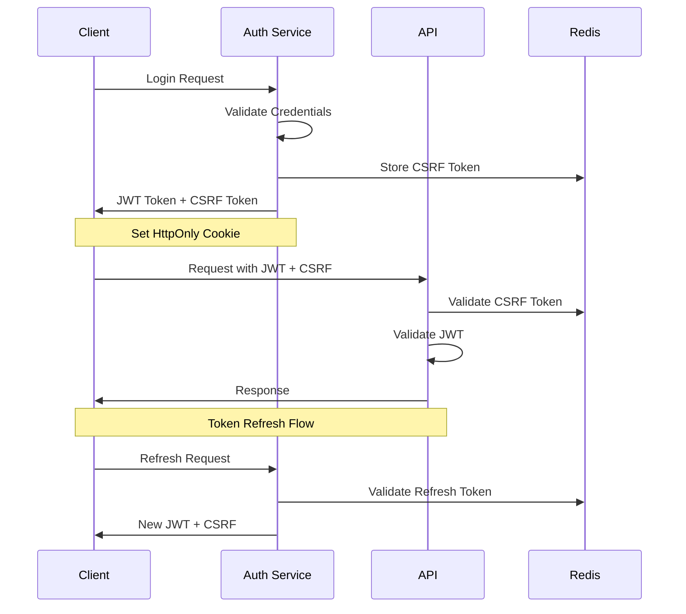

# Authentication Documentation
_Version: 1.1.0_
_Last Updated: 2024-02-22_

## Overview
This document details the authentication system used across the application, including security measures, token management, and implementation guidelines.

## Authentication Flow


## JWT Implementation

### Token Structure
```typescript
interface JWTPayload {
  sub: string;        // User ID
  exp: number;        // Expiration timestamp
  iat: number;        // Issued at timestamp
  scope: string[];    // User permissions
  jti: string;        // Unique token ID for revocation
  csrf: string;       // CSRF token hash
}

interface RefreshTokenPayload {
  sub: string;        // User ID
  exp: number;        // Expiration timestamp
  iat: number;        // Issued at timestamp
  family: string;     // Token family for rotation
  jti: string;        // Unique token ID
}
```

### Token Management
- Access token expiration: 15 minutes
- Refresh token expiration: 7 days
- Token rotation on refresh
- Secure storage in HttpOnly cookies
- Double Submit CSRF protection
- Token revocation support

## Security Measures

### 1. CSRF Protection
```typescript
interface CSRFConfig {
  cookieName: string;     // X-CSRF-Token
  headerName: string;     // X-CSRF-Token
  cookieOptions: {
    httpOnly: false,      // Must be accessible by JS
    secure: true,
    sameSite: 'strict',
    path: '/'
  }
}

// CSRF Token Validation
function validateCSRFToken(request: Request): boolean {
  const cookie = request.cookies[CSRF_COOKIE_NAME];
  const header = request.headers[CSRF_HEADER_NAME];
  return cookie && header && crypto.timingSafeEqual(cookie, header);
}
```

### 2. Rate Limiting
```typescript
interface RateLimitConfig {
  login: {
    points: 5,            // Attempts allowed
    duration: 300,        // Time window in seconds
    blockDuration: 900    // Block duration in seconds
  },
  refresh: {
    points: 20,
    duration: 3600,
    blockDuration: 1800
  }
}

// Rate Limit Headers
interface RateLimitHeaders {
  'X-RateLimit-Limit': number;
  'X-RateLimit-Remaining': number;
  'X-RateLimit-Reset': number;
  'Retry-After'?: number;
}
```

### 3. Token Storage
```typescript
interface TokenStorage {
  accessToken: {
    httpOnly: true,
    secure: true,
    sameSite: 'strict',
    path: '/',
    maxAge: 900          // 15 minutes
  },
  refreshToken: {
    httpOnly: true,
    secure: true,
    sameSite: 'strict',
    path: '/api/auth',    // Restricted path
    maxAge: 604800       // 7 days
  }
}
```

## API Authentication

### Request Format
```typescript
interface AuthenticatedRequest {
  headers: {
    Authorization: string;     // Format: "Bearer <token>"
    'X-CSRF-Token': string;   // CSRF token
  },
  cookies: {
    'access_token': string;   // JWT token
    'refresh_token'?: string; // Optional refresh token
    'csrf_token': string;     // CSRF token
  }
}

interface AuthResponse {
  user: {
    id: string;
    username: string;
    scope: string[];
  },
  tokens: {
    expires_in: number;      // Token expiration in seconds
  }
}
```

### Error Responses
```typescript
interface AuthError {
  error: {
    code: string;      // Error code
    message: string;   // Human-readable message
    status: number;    // HTTP status code
    details?: {
      retry_after?: number;  // For rate limit errors
      scopes_required?: string[];  // For permission errors
    }
  }
}

// Common Error Codes
type AuthErrorCode =
  | 'invalid_credentials'    // Wrong username/password
  | 'invalid_token'         // Malformed/expired token
  | 'insufficient_scope'    // Missing permissions
  | 'invalid_csrf'         // CSRF validation failed
  | 'rate_limited'         // Too many attempts
  | 'token_revoked'        // Token has been revoked
```

## Implementation Examples

### 1. Token Validation Middleware
```python
async def validate_token(request: Request):
    token = request.cookies.get("access_token")
    csrf_token = request.headers.get("X-CSRF-Token")
    
    if not token or not csrf_token:
        raise HTTPException(
            status_code=401,
            detail="Missing authentication credentials"
        )
    
    try:
        # Validate CSRF token
        if not await validate_csrf_token(request):
            raise HTTPException(
                status_code=403,
                detail="Invalid CSRF token"
            )
        
        # Decode and validate JWT
        payload = jwt.decode(
            token,
            settings.JWT_SECRET,
            algorithms=["HS256"]
        )
        
        # Check if token has been revoked
        if await is_token_revoked(payload["jti"]):
            raise HTTPException(
                status_code=401,
                detail="Token has been revoked"
            )
        
        return payload
        
    except JWTError as e:
        raise HTTPException(
            status_code=401,
            detail=str(e)
        )
```

### 2. Token Refresh with Rotation
```python
@router.post("/refresh")
async def refresh_token(
    request: Request,
    refresh_token: str = Cookie(None)
) -> dict:
    if not refresh_token:
        raise HTTPException(
            status_code=401,
            detail="No refresh token"
        )
    
    try:
        # Decode refresh token
        payload = jwt.decode(
            refresh_token,
            settings.JWT_REFRESH_SECRET,
            algorithms=["HS256"]
        )
        
        # Validate token family
        if await is_family_compromised(payload["family"]):
            await revoke_token_family(payload["family"])
            raise HTTPException(
                status_code=401,
                detail="Token family compromised"
            )
        
        # Create new tokens
        new_access_token = create_access_token(payload["sub"])
        new_refresh_token = create_refresh_token(
            payload["sub"],
            payload["family"]
        )
        
        # Revoke old refresh token
        await revoke_refresh_token(payload["jti"])
        
        # Set cookies and headers
        response = JSONResponse({
            "access_token": new_access_token
        })
        set_token_cookies(response, new_access_token, new_refresh_token)
        
        return response
        
    except JWTError:
        raise HTTPException(
            status_code=401,
            detail="Invalid refresh token"
        )
```

## Testing

### Unit Tests
```python
def test_token_validation():
    # Valid token and CSRF
    token = create_test_token()
    csrf = create_csrf_token()
    assert validate_token_and_csrf(token, csrf) is not None

    # Invalid CSRF
    with pytest.raises(HTTPException) as exc:
        validate_token_and_csrf(token, "invalid_csrf")
    assert exc.value.status_code == 403

    # Revoked token
    revoked_token = create_revoked_token()
    with pytest.raises(HTTPException) as exc:
        validate_token_and_csrf(revoked_token, csrf)
    assert exc.value.status_code == 401

    # Rate limited
    for _ in range(6):  # Exceed rate limit
        try:
            create_test_token()
        except HTTPException as exc:
            assert exc.value.status_code == 429
            assert "Retry-After" in exc.value.headers
```

## Configuration

### Environment Variables
```bash
# JWT Configuration
JWT_SECRET=your_jwt_secret_key
JWT_ALGORITHM=HS256
JWT_ACCESS_EXPIRATION=900  # 15 minutes
JWT_REFRESH_SECRET=your_refresh_secret_key
JWT_REFRESH_EXPIRATION=604800  # 7 days

# Redis Configuration
REDIS_URL=redis://localhost:6379/0
REDIS_PREFIX=auth:

# Rate Limiting
RATE_LIMIT_REDIS_URL=redis://localhost:6379/1
RATE_LIMIT_PREFIX=rl:

# CSRF Protection
CSRF_SECRET=your_csrf_secret_key
CSRF_HEADER=X-CSRF-Token
```

## Best Practices

### 1. Token Security
- Use strong secret keys (min 256 bits)
- Rotate secrets regularly (max 90 days)
- Implement token revocation with Redis
- Monitor failed authentication attempts
- Use secure random for token generation

### 2. Error Handling
- Provide clear but safe error messages
- Log authentication failures (exclude credentials)
- Implement graduated rate limiting
- Handle all edge cases explicitly
- Return standardized error responses

### 3. Performance
- Cache token validation results
- Use connection pooling for Redis
- Monitor authentication latency
- Implement distributed rate limiting
- Use efficient token formats

### 4. Monitoring
- Track authentication failures
- Monitor token usage patterns
- Alert on unusual activity
- Track rate limit hits
- Monitor token revocations
