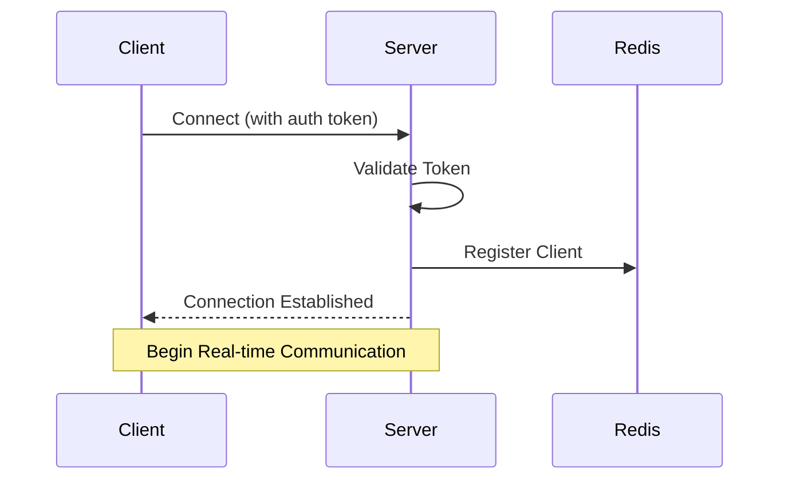

# WebSocket API Guide
_Version: 1.0.0_
_Last Updated: 2024-02-22_

## Overview
This document details the WebSocket implementation for real-time communication in our application. The WebSocket system handles document collaboration, chat functionality, and live updates using Socket.IO.

## Connection Flow

### 1. Connection Sequence


## Socket Events

### Authentication Events

#### connect
Emitted when a client connects to the WebSocket server.

```typescript
// Client
socket.on('connect', () => {
    console.log('Connected to WebSocket server');
});

// Server
@sio.on('connect')
async def handle_connect(sid: str):
    try:
        token = await sio.get_session(sid)
        user = await validate_token(token)
        await sio.save_session(sid, {'user_id': user.id})
        logger.info(f"User {user.id} connected")
    except Exception as e:
        logger.error(f"Connection error: {str(e)}")
        await sio.disconnect(sid)
```

#### disconnect
Emitted when a client disconnects from the WebSocket server.

```typescript
// Client
socket.on('disconnect', () => {
    console.log('Disconnected from WebSocket server');
});

// Server
@sio.on('disconnect')
async def handle_disconnect(sid: str):
    try:
        session = await sio.get_session(sid)
        user_id = session.get('user_id')
        if user_id:
            logger.info(f"User {user_id} disconnected")
    except Exception as e:
        logger.error(f"Disconnect error: {str(e)}")
```

### Document Events

#### documents:join
Join a document collaboration session.

```typescript
// Client
socket.emit('documents:join', { document_id: 'doc123' });

// Server
@sio.on('documents:join')
async def handle_document_join(sid: str, data: Dict):
    try:
        document_id = data['document_id']
        session = await sio.get_session(sid)
        user_id = session['user_id']
        
        # Verify access
        if not await can_access_document(user_id, document_id):
            raise PermissionError("No access to document")
            
        # Join room
        room = f"document_{document_id}"
        sio.enter_room(sid, room)
        
        # Notify others
        await sio.emit('user:joined', {
            'user_id': user_id
        }, room=room, skip_sid=sid)
    except Exception as e:
        await handle_error(sio, sid, e)
```

#### documents:update
Update document content.

```typescript
// Client
socket.emit('documents:update', {
    document_id: 'doc123',
    content: 'Updated content',
    version: 2
});

// Server
@sio.on('documents:update')
async def handle_document_update(sid: str, data: Dict):
    try:
        document_id = data['document_id']
        content = data['content']
        version = data['version']
        
        session = await sio.get_session(sid)
        user_id = session['user_id']
        
        # Verify permissions
        if not await can_edit_document(user_id, document_id):
            raise PermissionError("Cannot edit document")
            
        # Update document
        document = await update_document(document_id, content, version)
        
        # Broadcast to others
        room = f"document_{document_id}"
        await sio.emit('documents:updated', {
            'document': document,
            'user_id': user_id
        }, room=room, skip_sid=sid)
    except Exception as e:
        await handle_error(sio, sid, e)
```

### Chat Events

#### chat:join
Join a chat room.

```typescript
// Client
socket.emit('chat:join', { chat_id: 'chat123' });

// Server
@sio.on('chat:join')
async def handle_chat_join(sid: str, data: Dict):
    try:
        chat_id = data['chat_id']
        session = await sio.get_session(sid)
        user_id = session['user_id']
        
        # Join room
        room = f"chat_{chat_id}"
        sio.enter_room(sid, room)
        
        # Notify others
        await sio.emit('user:joined', {
            'user_id': user_id
        }, room=room, skip_sid=sid)
    except Exception as e:
        await handle_error(sio, sid, e)
```

#### chat:message
Send a chat message.

```typescript
// Client
socket.emit('chat:message', {
    chat_id: 'chat123',
    content: 'Hello, world!'
});

// Server
@sio.on('chat:message')
async def handle_chat_message(sid: str, data: Dict):
    try:
        chat_id = data['chat_id']
        content = data['content']
        session = await sio.get_session(sid)
        user_id = session['user_id']
        
        # Save message
        message = await save_chat_message(chat_id, user_id, content)
        
        # Broadcast to room
        room = f"chat_{chat_id}"
        await sio.emit('chat:message', {
            'message': message
        }, room=room)
    except Exception as e:
        await handle_error(sio, sid, e)
```

## Error Handling

### Error Event Structure
```typescript
interface SocketError {
    code: string;
    message: string;
    details?: any;
}

// Error event handler
socket.on('error', (error: SocketError) => {
    console.error('Socket error:', error);
});
```

### Server-side Error Handler
```python
async def handle_error(sio: AsyncServer, sid: str, error: Exception):
    error_data = {
        'code': type(error).__name__,
        'message': str(error)
    }
    
    if isinstance(error, PermissionError):
        error_data['code'] = 'PERMISSION_DENIED'
    elif isinstance(error, ValueError):
        error_data['code'] = 'INVALID_INPUT'
    else:
        error_data['code'] = 'INTERNAL_ERROR'
        logger.error(f"Socket error: {str(error)}", exc_info=error)
    
    await sio.emit('error', error_data, room=sid)
```

## Client Implementation

### Socket Manager
```typescript
class SocketManager {
    private socket: Socket | null = null;
    private reconnectAttempts = 0;
    private readonly MAX_RECONNECT_ATTEMPTS = 5;
    
    constructor(private readonly url: string) {}
    
    connect(token: string): void {
        this.socket = io(this.url, {
            auth: { token },
            reconnection: true,
            reconnectionDelay: 1000,
            reconnectionDelayMax: 5000,
            timeout: 20000
        });
        
        this.setupListeners();
    }
    
    private setupListeners(): void {
        this.socket?.on('connect', () => {
            this.reconnectAttempts = 0;
            this.emit('connected');
        });
        
        this.socket?.on('disconnect', () => {
            this.handleDisconnect();
        });
        
        this.socket?.on('error', (error) => {
            this.handleError(error);
        });
    }
    
    private handleDisconnect(): void {
        if (this.reconnectAttempts < this.MAX_RECONNECT_ATTEMPTS) {
            this.reconnectAttempts++;
            setTimeout(() => this.reconnect(), 1000 * this.reconnectAttempts);
        } else {
            this.emit('error', {
                code: 'MAX_RECONNECT_EXCEEDED',
                message: 'Maximum reconnection attempts exceeded'
            });
        }
    }
    
    private handleError(error: any): void {
        console.error('Socket error:', error);
        this.emit('error', error);
    }
}
```

## Testing

### Unit Tests
```python
import pytest
from unittest.mock import AsyncMock, patch

@pytest.mark.asyncio
async def test_document_update():
    # Mock dependencies
    mock_db = AsyncMock()
    mock_db.can_edit_document.return_value = True
    mock_db.update_document.return_value = {
        "id": "doc123",
        "content": "Updated content",
        "version": 2
    }
    
    # Create handler with mocks
    handler = SocketEventHandler(mock_sio, mock_db)
    
    # Test update
    await handler.handle_document_update("test_sid", {
        "document_id": "doc123",
        "content": "Updated content",
        "version": 2
    })
    
    # Verify calls
    mock_db.can_edit_document.assert_called_once()
    mock_db.update_document.assert_called_once()
```

### Integration Tests
```typescript
describe('Socket Integration', () => {
    let socket: SocketManager;
    
    beforeEach(() => {
        socket = new SocketManager('ws://localhost:8000');
    });
    
    afterEach(() => {
        socket.disconnect();
    });
    
    it('handles document updates', async () => {
        // Connect to socket
        await socket.connect(testToken);
        
        // Join document
        await socket.emit('documents:join', { document_id: 'doc123' });
        
        // Send update
        await socket.emit('documents:update', {
            document_id: 'doc123',
            content: 'Test content',
            version: 1
        });
        
        // Wait for update confirmation
        const response = await waitForEvent(socket, 'documents:updated');
        expect(response.document.content).toBe('Test content');
    });
});
```

For more information about authentication, see [authentication.md](./authentication.md).
For real-time features implementation, refer to [streaming.md](../technical/streaming.md).
