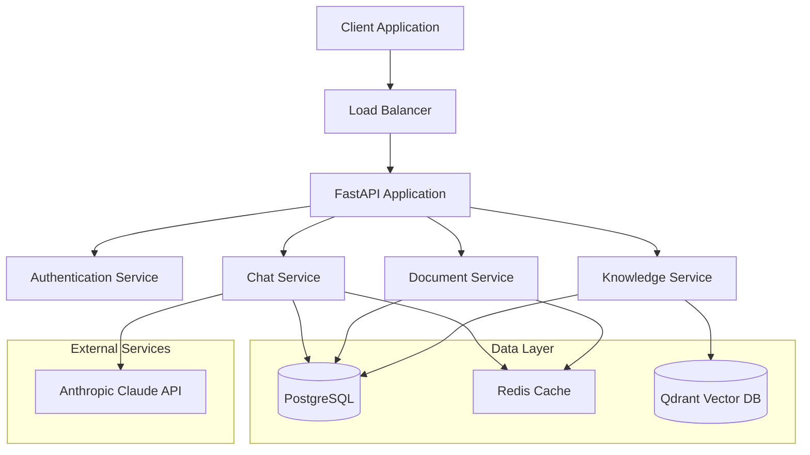
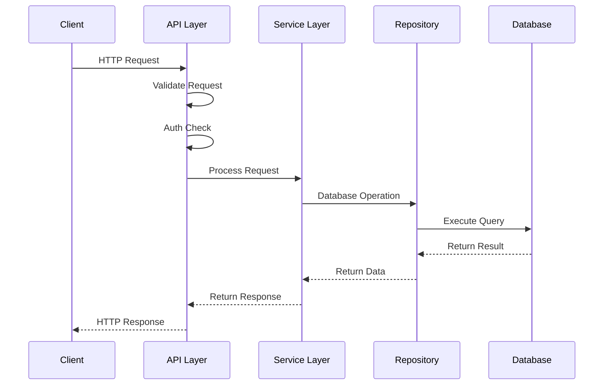
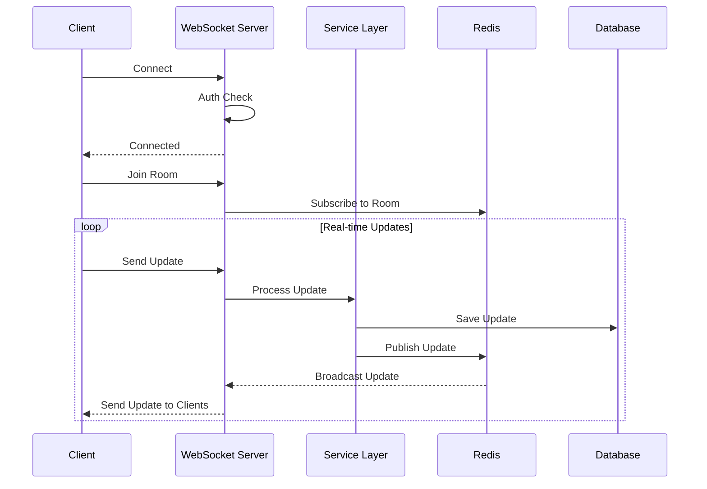
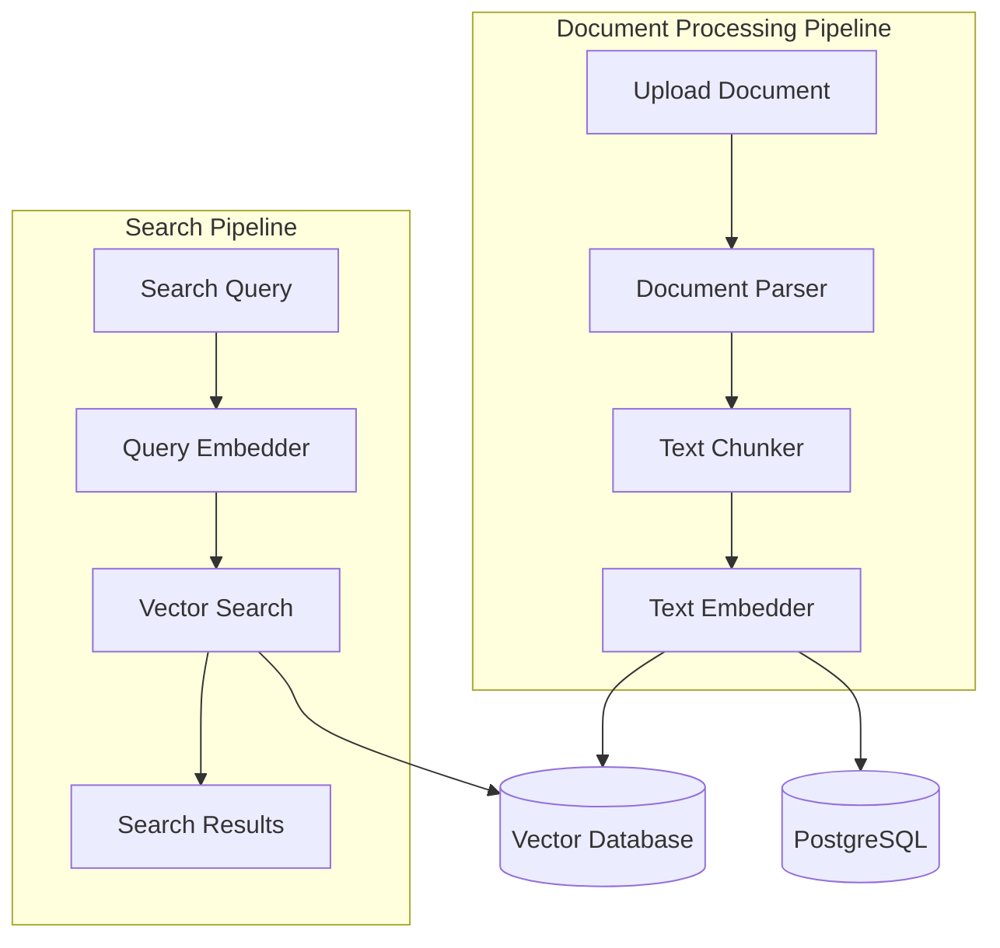

# Backend Architecture Diagrams

## System Architecture

```mermaid
graph TD
    Client[Client Application] --> LB[Load Balancer]
    LB --> API[FastAPI Application]
    API --> Auth[Authentication Service]
    API --> Chat[Chat Service]
    API --> Doc[Document Service]
    API --> Know[Knowledge Service]
    
    Chat --> DB[(PostgreSQL)]
    Doc --> DB
    Know --> DB
    
    Chat --> Redis[Redis Cache]
    Doc --> Redis
    
    Know --> Vector[(Qdrant Vector DB)]
    
    Chat --> Claude[Anthropic Claude API]
    
    subgraph "Data Layer"
        DB
        Redis
        Vector
    end
    
    subgraph "External Services"
        Claude
    end
```

## Request Flow

```mermaid
sequenceDiagram
    participant C as Client
    participant A as API Layer
    participant S as Service Layer
    participant R as Repository
    participant D as Database
    
    C->>A: HTTP Request
    A->>A: Validate Request
    A->>A: Auth Check
    A->>S: Process Request
    S->>R: Database Operation
    R->>D: Execute Query
    D-->>R: Return Result
    R-->>S: Return Data
    S-->>A: Return Response
    A-->>C: HTTP Response
```

## WebSocket Communication

```mermaid
sequenceDiagram
    participant C as Client
    participant WS as WebSocket Server
    participant S as Service Layer
    participant R as Redis
    participant D as Database
    
    C->>WS: Connect
    WS->>WS: Auth Check
    WS-->>C: Connected
    
    C->>WS: Join Room
    WS->>R: Subscribe to Room
    
    loop Real-time Updates
        C->>WS: Send Update
        WS->>S: Process Update
        S->>D: Save Update
        S->>R: Publish Update
        R-->>WS: Broadcast Update
        WS-->>C: Send Update to Clients
    end
```

## Knowledge Store Architecture

```mermaid
graph TD
    Upload[Upload Document] --> Parser[Document Parser]
    Parser --> Chunker[Text Chunker]
    Chunker --> Embedder[Text Embedder]
    
    Embedder --> VectorDB[(Vector Database)]
    Embedder --> MetadataDB[(PostgreSQL)]
    
    Search[Search Query] --> QueryEmbed[Query Embedder]
    QueryEmbed --> VectorSearch[Vector Search]
    VectorSearch --> VectorDB
    VectorSearch --> Results[Search Results]
    
    subgraph "Document Processing Pipeline"
        Upload
        Parser
        Chunker
        Embedder
    end
    
    subgraph "Search Pipeline"
        Search
        QueryEmbed
        VectorSearch
        Results
    end
```
