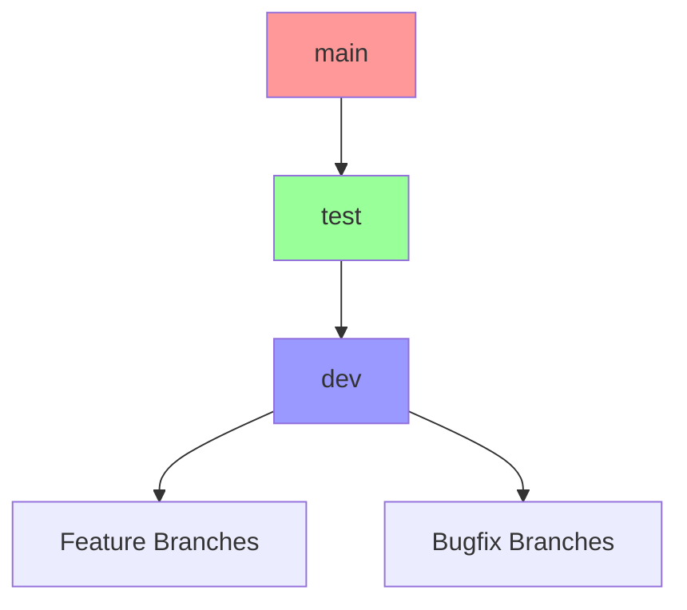

# Branch Structure Cleanup and Setup Instructions

## Target Branch Structure


## Current Issues to Address
1. Branch structure needs realignment
2. Test branch needs to be integrated into workflow
3. Missing branch protection rules
4. Outdated feature and bug branches
5. Workflow triggers need updating

## Existing Workflow Analysis
Current workflows:
- `integration-test.yml`: Cypress and Migration tests
- `format-backend.yaml`: Python formatting and checks
- `format-build-frontend.yaml`: Frontend build and format
- `build-release.yml`: Release builds
- `deploy-to-hf-spaces.yml`: Deployment workflow
- `docker-build.yaml`: Docker image building
- `release-pypi.yml`: PyPI release workflow

## Step-by-Step Cleanup and Setup Instructions

### Phase 1: Branch Cleanup
1. **Backup Current State**
   ```bash
   git branch -a > branch_backup.txt
   ```

2. **Clean Up Old Branches**
   ```bash
   # Delete old feature branch
   git branch -d feature/test-workflow
   git push origin --delete feature/test-workflow
   
   # Delete old bug fix branch
   git push origin --delete bugs/test-fix-001
   ```

### Phase 2: Branch Restructuring
1. **Ensure Main Branch is Up-to-Date**
   ```bash
   git checkout main
   git pull origin main
   ```

2. **Reset Test Branch from Main**
   ```bash
   git checkout test
   git reset --hard main
   git push origin test --force
   ```

3. **Reset Dev Branch from Test**
   ```bash
   git checkout dev
   git reset --hard test
   git push origin dev --force
   ```

### Phase 3: Workflow Updates
1. **Update Integration Test Workflow** (.github/workflows/integration-test.yml)
   ```yaml
   name: Integration Test
   on:
     push:
       branches:
         - dev
         - test
     pull_request:
       branches:
         - test
         - main
   ```

2. **Update Format Backend Workflow** (.github/workflows/format-backend.yaml)
   ```yaml
   name: Python CI
   on:
     push:
       branches:
         - dev
         - dev/**
     pull_request:
       branches:
         - test
         - main
   ```

3. **Update Frontend Build Workflow** (.github/workflows/format-build-frontend.yaml)
   ```yaml
   name: Frontend Build
   on:
     push:
       branches:
         - dev
         - dev/**
     pull_request:
       branches:
         - test
         - main
   ```

4. **Create Deployment Approval Workflow** (.github/workflows/deployment-approval.yml)
   ```yaml
   name: Deployment Approval
   on:
     pull_request:
       branches:
         - main
   
   jobs:
     approval:
       runs-on: ubuntu-latest
       steps:
         - name: Pending Approval
           uses: softprops/action-gh-release@v1
           with:
             draft: true
   ```

### Phase 4: Branch Protection Rules Setup
1. **Dev Branch Protection**
   - Go to Repository Settings → Branches
   - Add rule for `dev`:
     - Require status checks to pass:
       - Format Backend
       - Frontend Build
       - Integration Test
     - Include administrators in restrictions

2. **Test Branch Protection**
   - Add rule for `test`:
     - Require status checks to pass:
       - Integration Test
       - Format Backend
       - Frontend Build
     - Require pull request reviews
     - Require approval from code owners
     - Include administrators in restrictions

3. **Main Branch Protection** (Final Step)
   - Add rule for `main`:
     - Require pull request reviews
     - Require approval from code owners
     - Require status checks to pass
     - Require deployment approval
     - Include administrators in restrictions

## New Development Process
1. Create feature branch from dev: `git checkout -b dev/feature-name dev`
2. Develop and push changes
3. Automated tests run on push to dev branch
4. Create PR to merge into test
5. Integration tests run automatically
6. Manual approval required for test
7. Create PR from test to main
8. Final approval and deployment check required

## Additional Setup Requirements
1. Create CODEOWNERS file with appropriate reviewers
2. Configure deployment environments in GitHub
3. Update deployment workflows for the new branch structure
4. Set up branch-specific environment variables if needed

## Important Notes
- Feature branches should follow `dev/feature-name` convention
- Bugfix branches should follow `dev/fix-name` convention
- Keep branches short-lived
- Delete feature branches after merging
- All deployments must go through the proper promotion chain

## Rollback Procedures
In case of issues:
1. Use branch backup from step 1
2. Reset to previous state using:
   ```bash
   git checkout [branch]
   git reset --hard [previous-hash]
   git push --force origin [branch]
   ```
3. Disable branch protection temporarily if needed
4. Re-enable protection rules after recovery
