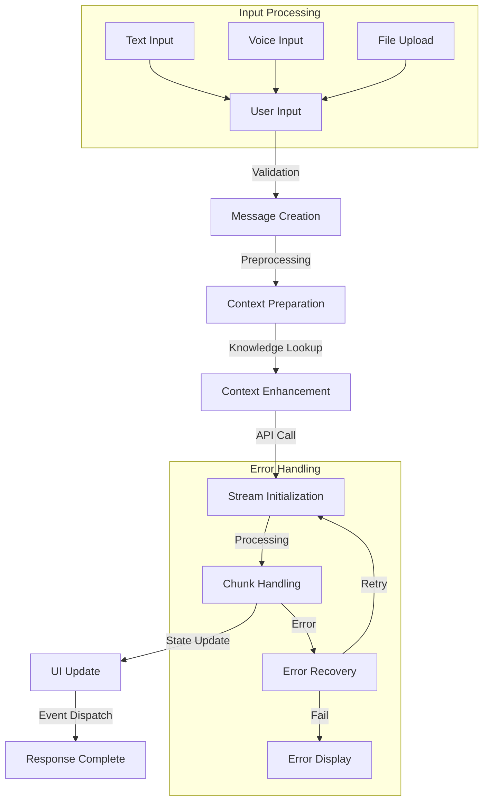
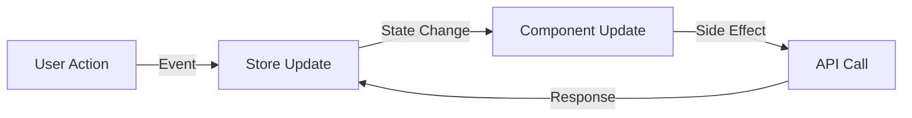

# Chat System Documentation
_Version: 1.3.1_
_Last Updated: 2024-02-23_

## Overview
The chat system provides real-time message streaming and multi-model interactions through a modular component architecture. It supports rich text input, voice recording, file attachments, web search integration, YouTube transcription processing, and knowledge store integration for enhanced context retrieval.

## Overview System
The chat system includes a visual conversation flow overview using SvelteFlow:

```typescript
interface OverviewSystem {
    visualization: {
        nodeTypes: {
            custom: typeof CustomNode;  // Custom node component
        };
        layout: {
            levelOffset: number;       // Vertical spacing
            siblingOffset: number;     // Horizontal spacing
            autoCenter: boolean;       // Auto-centering
        };
        features: {
            panZoom: boolean;         // Pan and zoom
            nodeSelection: boolean;    // Node selection
            autoFit: boolean;         // Auto-fit view
            darkMode: boolean;        // Theme support
        };
    };
    nodes: {
        id: string;                   // Node identifier
        type: string;                 // Node type
        data: {                       // Node data
            user: User;               // User info
            message: Message;         // Message content
            model: Model;             // Model info
        };
        position: {                   // Node position
            x: number;
            y: number;
        };
    }[];
    edges: {                         // Edge connections
        id: string;                  // Edge identifier
        source: string;              // Source node
        target: string;              // Target node
        type: string;                // Edge type
    }[];
}
```

### Features
- Interactive conversation flow visualization
- Message hierarchy representation
- Node-based navigation
- Pan and zoom capabilities
- Auto-centering and fitting
- Dark/light mode support
- Real-time updates

Example usage:
```svelte
<Overview
    {history}
    on:close={() => showOverview.set(false)}
    on:nodeClick={(event) => {
        // Handle node selection
        showMessage(event.detail.message);
    }}
/>
```

### Flow Visualization
The overview system creates a visual representation of the chat:
1. Node Layout:
   - Hierarchical structure
   - Level-based positioning
   - Sibling spacing
   - Parent-child relationships

2. Node Content:
   - Message preview
   - User information
   - Model details
   - Timestamp

3. Interaction:
   - Click to view message
   - Pan to navigate
   - Zoom to explore
   - Auto-focus on selection

## Architecture

### Component Structure
```
src/lib/components/chat/
├── Chat.svelte              # Main chat orchestrator
├── ChatSimple.svelte        # Lightweight alternative
├── MessageInput/            # Input handling components
│   ├── MessageInput.svelte  # Main input component
│   ├── InputMenu.svelte     # Input options menu
│   ├── Commands.svelte      # Chat commands
│   ├── FilesOverlay.svelte  # File upload overlay
│   └── VoiceRecording.svelte # Voice input handling
├── layout/                  # Layout components
│   ├── ChatSidebar/        # Chat sidebar components
│   │   ├── Sidebar.svelte  # Main sidebar component
│   │   ├── ChatList.svelte # Chat list management
│   │   ├── FolderItem.svelte # Folder management
│   │   ├── FolderList.svelte # Virtual folder rendering
│   │   └── Search.svelte   # Chat search interface
│   └── MessageArea/        # Message display components
│       ├── Message.svelte  # Message component
│       ├── Attachments/    # File attachment handling
│       └── Controls/       # Message controls
├── ModelSelector/           # Model selection components
│   ├── Selector.svelte     # Model selection interface
│   └── Settings.svelte     # Model settings management
└── Controls/                # Control system components
    ├── Controls.svelte     # Main control panel
    ├── Valves.svelte       # Flow control system
    └── Settings/           # Settings components
        └── Advanced/      # Advanced parameter controls
```

### Features
- Rich text input with markdown support
- Voice recording and transcription
- Multi-model chat support
- File attachments with drag-and-drop
- Real-time message streaming
- Web search integration
- YouTube transcription processing
- Knowledge store integration
- Chat folder organization
- Message history navigation
- Error recovery and retry mechanisms

### Service Architecture
The chat system uses a streamlined service architecture:
- Direct API calls through `$lib/apis/chats` and `$lib/apis/streaming`
- Knowledge store integration via `$lib/apis/knowledge`
- Audio transcription via `$lib/apis/audio`
- File handling via `$lib/apis/files`
- Unified message handling in Chat.svelte
- Centralized event handling through EventTarget
- Model-specific processing with OpenAI and Ollama support

### Message Processing Flow


## Routes
- `/c` - Base chat route, automatically creates a new chat
- `/c/[id]` - Specific chat route with chat ID
- `/c/[id]/share` - Shareable chat view (read-only)
- `/c/[id]/export` - Chat export options

## Components

### ChatSidebar
The main sidebar component that displays the list of chats and handles user interactions.

#### Features
- Virtual scrolling for optimal performance
- Infinite scroll pagination
- Error boundary integration
- Loading states
- Accessibility support
- Keyboard navigation

#### Props
```typescript
{
    fetchChats: () => Promise<{ items: ChatItem[], total: number }>;
    fetchMoreChats: () => Promise<{ items: ChatItem[], total: number }>;
}
```

#### Usage
```svelte
<ChatSidebar
    fetchChats={async () => {
        const response = await fetch('/api/chats');
        return response.json();
    }}
    fetchMoreChats={async () => {
        const response = await fetch('/api/chats?page=2');
        return response.json();
    }}
/>
```

### ChatItem
Individual chat item component with support for various actions.

#### Features
- Rename, delete, archive, and share actions
- Pin/unpin functionality
- Loading states
- Error handling
- Accessibility support
- Keyboard navigation

#### Props
```typescript
{
    item: ChatItem;
    className?: string;
}
```

### Chat
The main chat component:
```typescript
interface ChatProps {
    chatId?: string;              // Chat ID for loading
    initialMessages?: Message[];   // Initial messages
    models?: Model[];             // Available models
    settings?: ChatSettings;      // Chat settings
    onSave?: (messages: Message[]) => void;
    onError?: (error: Error) => void;
    readOnly?: boolean;           // Read-only mode
    stream?: boolean;             // Enable streaming
}

// Usage
<Chat
    chatId={params.id}
    models={availableModels}
    settings={{
        temperature: 0.7,
        maxTokens: 1000,
        stream: true
    }}
    onError={handleError}
/>

## Control System
The chat system includes a sophisticated control panel that provides fine-grained control over chat behavior:

#### Components
```
src/lib/components/chat/Controls/
├── Controls.svelte         # Main control panel
├── Valves.svelte          # Flow control system
└── Settings/              # Settings components
    └── Advanced/          # Advanced parameter controls
```

#### Features
- System prompt configuration
- Advanced parameter tuning
- File attachment management
- Valve system for controlling:
  - Tool access and permissions
  - Function execution flow
  - Model-specific settings

#### Valve System
The valve system provides granular control over chat functionality:
```typescript
interface ValveSpec {
    type: 'boolean' | 'number' | 'array' | 'string';
    title: string;
    description?: string;
    default?: any;
    minimum?: number;
    maximum?: number;
    items?: {
        type: string;
        enum?: string[];
    };
}

interface ValveConfiguration {
    [key: string]: {
        enabled: boolean;
        value: any;
        spec: ValveSpec;
    };
}
```

Example valve configuration:
```typescript
{
    "tool_access": {
        "type": "array",
        "items": {
            "type": "string",
            "enum": ["read", "write", "execute"]
        },
        "default": ["read"],
        "description": "Tool access permissions"
    },
    "rate_limit": {
        "type": "number",
        "minimum": 0,
        "maximum": 100,
        "default": 10,
        "description": "Requests per minute"
    }
}
```

## Artifacts System
The chat system includes a powerful artifacts handling system that processes and renders code snippets and content:

```typescript
interface ArtifactSystem {
    contentTypes: {
        html: boolean;           // HTML content
        css: boolean;           // CSS styling
        javascript: boolean;     // JavaScript code
        markdown: boolean;       // Markdown content
    };
    rendering: {
        sandbox: boolean;        // Sandbox mode
        isolation: boolean;      // Content isolation
        autoRefresh: boolean;    // Auto refresh on changes
    };
    features: {
        panZoom: boolean;       // Pan and zoom support
        copyToClipboard: boolean; // Copy support
        fullscreen: boolean;     // Fullscreen mode
        linkHandling: boolean;   // External link handling
    };
}
```

### Content Processing
The artifacts system processes various types of content:
1. Code Blocks:
   ```typescript
   interface CodeBlock {
       lang: string;            // Language identifier
       code: string;            // Code content
       metadata?: {            // Optional metadata
           title?: string;
           description?: string;
           version?: string;
       };
   }
   ```

2. Inline Content:
   - HTML: `<html>...</html>`
   - CSS: `<style>...</style>`
   - JavaScript: `<script>...</script>`

3. Rendered Output:
   ```html
   <!DOCTYPE html>
   <html lang="en">
   <head>
       <meta charset="UTF-8">
       <meta name="viewport" content="width=device-width, initial-scale=1.0">
       <style>
           /* Processed CSS content */
       </style>
   </head>
   <body>
       <!-- Processed HTML content -->
       <script>
           // Processed JavaScript content
       </script>
   </body>
   </html>
   ```

### Features
- Automatic code extraction and processing
- Secure sandbox environment
- Pan and zoom capabilities
- Copy to clipboard functionality
- Fullscreen mode
- External link handling
- Dark/light mode support

Example usage:
```svelte
<Artifacts
    {history}
    overlay={false}
    on:close={() => showArtifacts.set(false)}
    on:expand={() => {
        overlay = true;
    }}
/>
```

## Rich Text Editor
The chat system includes a Prosemirror-based rich text editor with TipTap extensions:
```typescript
interface RichTextEditorConfig {
    extensions: [
        StarterKit,                // Basic editing features
        CodeBlockLowlight,         // Syntax highlighting
        Placeholder,               // Placeholder text
        Highlight,                 // Text highlighting
        Typography                 // Typography improvements
    ];
    features: {
        markdown: boolean;         // Markdown parsing
        codeHighlight: boolean;    // Code syntax highlighting
        templateCompletion: boolean; // Template handling
        pasteHandling: boolean;    // Smart paste handling
        shortcuts: boolean;        // Keyboard shortcuts
    };
}
```

Features:
- Markdown parsing and rendering
- Code block syntax highlighting
- Template completion with `[template]` and `{{template}}` syntax
- Smart paste handling with size limits
- Keyboard shortcuts
- Typography enhancements
- Placeholder support

Example usage:
```svelte
<RichTextInput
    id="chat-input"
    messageInput={true}
    shiftEnter={!$mobile}
    largeTextAsFile={true}
    placeholder="Type your message..."
    className="input-prose"
/>
```

## Voice Recording System
The chat system includes a sophisticated voice recording and processing system:

```typescript
interface VoiceRecordingConfig {
    audio: {
        minDecibels: number;       // Minimum audio level
        bufferLength: number;      // Visualizer buffer length
        silenceThreshold: number;  // Silence detection threshold
    };
    visualization: {
        rmsNormalization: {
            exponent: number;      // RMS normalization curve
            minScale: number;      // Minimum scale value
            maxScale: number;      // Maximum scale value
        };
        updateInterval: number;    // Visualization refresh rate
    };
    transcription: {
        realtime: boolean;        // Real-time transcription
        format: string;           // Audio format
        quality: number;          // Recording quality
    };
}
```

Features:
- High-quality audio recording
- Real-time audio visualization
- Sound level detection
- Silence detection
- Audio transcription
- Duration tracking
- Error handling

Example implementation:
```svelte
<VoiceRecording
    bind:recording
    className="p-2.5 w-full max-w-full"
    on:transcription={(event) => {
        // Handle transcribed text
        prompt = event.detail.text;
    }}
/>
```

The voice recording system includes:
1. Audio Processing:
   - RMS (Root Mean Square) level calculation
   - Audio normalization
   - Frequency analysis
   - Time domain analysis

2. Visualization:
   - Real-time waveform display
   - Sound level indicators
   - Recording duration display

3. Transcription:
   - Audio to text conversion
   - Multiple language support
   - Punctuation inference
   - Speaker detection

## Settings System
The chat system includes a comprehensive settings management system:

```typescript
interface SettingsSystem {
    categories: {
        general: {                 // General settings
            language: string;      // Interface language
            theme: string;        // UI theme
            notifications: boolean; // Notification settings
            systemPrompt: string;  // Default system prompt
        };
        interface: {              // Interface settings
            defaultModel: string;  // Default chat model
            layout: {
                widescreen: boolean;
                direction: 'ltr' | 'rtl';
                showUsername: boolean;
            };
            display: {
                notifications: boolean;
                largechunks: boolean;
                scrollBehavior: string;
            };
            richText: {
                enabled: boolean;
                background: string;
            };
        };
        audio: {                  // Audio settings
            input: {
                device: string;
                sensitivity: number;
            };
            output: {
                device: string;
                volume: number;
            };
        };
        chats: {                  // Chat settings
            history: {
                retention: number;
                autoDelete: boolean;
            };
            sharing: {
                enabled: boolean;
                defaults: object;
            };
        };
        personalization: {        // Personal settings
            customPrompts: string[];
            shortcuts: object;
        };
    };
    search: {                     // Settings search
        keywords: string[];       // Search keywords
        results: SettingsTab[];   // Filtered results
    };
}
```

### Features
- Comprehensive settings categories
- Real-time settings updates
- Search functionality
- Settings persistence
- Import/Export capabilities
- Default value management

## Keyboard Shortcuts
The system provides extensive keyboard shortcuts for efficient interaction:

```typescript
interface ShortcutSystem {
    navigation: {
        newChat: 'Ctrl/⌘ + Shift + O';
        focusInput: 'Shift + Esc';
        toggleSettings: 'Ctrl/⌘ + ,';
        toggleOverview: 'Ctrl/⌘ + O';
    };
    editing: {
        copyLastCode: 'Ctrl/⌘ + Shift + ;';
        clearChat: 'Ctrl/⌘ + L';
        undoEdit: 'Ctrl/⌘ + Z';
    };
    commands: {
        prefix: '/';
        search: '@';
        models: '#';
    };
}
```

### Features
- Global keyboard shortcuts
- Command system integration
- Customizable bindings
- Context-aware shortcuts
- Cross-platform support (Windows/Mac)

## Share System
The chat system includes functionality for sharing conversations:

```typescript
interface ShareSystem {
    methods: {
        url: {                    // URL sharing
            generate: () => string;
            validate: () => boolean;
        };
        community: {              // Community sharing
            upload: () => Promise<void>;
            metadata: ShareMetadata;
        };
    };
    permissions: {
        public: boolean;          // Public access
        expiry: Date;            // Share expiration
        access: string[];        // Allowed users
    };
    content: {
        messages: Message[];      // Shared messages
        models: Model[];         // Used models
        metadata: object;        // Additional data
    };
}

interface ShareMetadata {
    id: string;                  // Share identifier
    url: string;                 // Share URL
    created: Date;               // Creation date
    expires: Date;               // Expiration date
    stats: {                     // Share statistics
        views: number;
        likes: number;
        comments: number;
    };
}
```

### Features
- URL-based sharing
- Community integration
- Access control
- Share statistics
- Expiration management
- Metadata preservation

## Data Types

### Core Types
```typescript
interface ChatState {
    history: ChatHistory;
    settings: ChatSettings;
    error?: Error;
}

interface FolderState {
    items: Record<string, FolderItem>;
    expandedFolders: Set<string>;
    draggedItem: {
        id: string;
        type: 'folder' | 'chat';
        title: string;
    } | null;
    error?: Error;
}

interface FolderItem {
    id: string;
    title: string;
    parent_id: string | null;
    is_expanded: boolean;
    level: number;
    children: string[];
    position: number;
    created: Date;
    updated: Date;
}

interface Chat {
    id: string;
    title: string;
    messages: Message[];
    models: Model[];
    settings: ChatSettings;
    created: Date;
    updated: Date;
    tags?: ChatTag[];
    shared?: boolean;
    temporary?: boolean;
    folder_id?: string;  // Reference to parent folder
}

interface Message {
    id: string;
    role: 'user' | 'assistant' | 'system';
    content: string;
    timestamp: Date;
    model?: string;
    parentId?: string;
    attachments?: Attachment[];
    metadata?: {
        tokens?: number;
        processingTime?: number;
        error?: Error;
    };
}
```

## Performance Optimizations

### Folder System
```typescript
// Virtual folder rendering
const virtualFolderList = new VirtualScroller({
    container: folderContainer,
    itemHeight: 32,
    overscan: 3,
    onVisibleItemsChange: loadFolders
});

// Efficient folder updates
const updateFolderPosition = async (
    sourceId: string, 
    targetId: string, 
    position: 'before' | 'after' | 'inside'
) => {
    try {
        await folderStore.moveItem(sourceId, targetId, 'folder', position);
        announceToScreenReader(`Moved folder ${sourceId} ${position} ${targetId}`);
    } catch (error) {
        console.error('Error moving folder:', error);
    }
};

// Optimized drag and drop
const handleDragStart = (event: DragEvent, item: FolderItem) => {
    const dragImage = createDragImage(item);
    event.dataTransfer?.setDragImage(dragImage, 0, 0);
    folderStore.setDraggedItem({
        id: item.id,
        type: 'folder',
        title: item.title
    });
};
```

### Message Handling
```typescript
// Efficient message updates
const updateMessage = (id: string, content: string) => {
    messages.update(msgs => ({
        ...msgs,
        [id]: {
            ...msgs[id],
            content,
            updated: new Date()
        }
    }));
};

// Virtual scrolling implementation
const virtualScroll = new VirtualScroller({
    container: messageContainer,
    itemHeight: 60,
    overscan: 5,
    onVisibleItemsChange: loadMessages
});
```

## Accessibility

### Keyboard Navigation
```typescript
// Folder keyboard controls
const handleFolderKeyDown = (event: KeyboardEvent, folder: FolderItem) => {
    switch (event.key) {
        case 'ArrowRight':
            if (!folder.is_expanded) {
                folderStore.toggleFolder(folder.id);
                announceToScreenReader(`Expanded folder ${folder.title}`);
            }
            break;
        case 'ArrowLeft':
            if (folder.is_expanded) {
                folderStore.toggleFolder(folder.id);
                announceToScreenReader(`Collapsed folder ${folder.title}`);
            }
            break;
        case 'Enter':
        case ' ':
            event.preventDefault();
            folderStore.toggleFolder(folder.id);
            announceToScreenReader(
                `${folder.is_expanded ? 'Collapsed' : 'Expanded'} folder ${folder.title}`
            );
            break;
    }
};

// ARIA announcements
const announceToScreenReader = (message: string) => {
    const announcement = document.createElement('div');
    announcement.setAttribute('role', 'status');
    announcement.setAttribute('aria-live', 'polite');
    announcement.textContent = message;
    document.body.appendChild(announcement);
    setTimeout(() => announcement.remove(), 1000);
};
```

### Screen Reader Support
Components implement proper ARIA attributes:
- `role="listbox"` and `role="option"` for chat list
- `aria-selected` for current selection
- `aria-label` for buttons and inputs
- `aria-expanded` and `aria-haspopup` for menus
- Status announcements for loading and errors

## State Management

### Store Structure
```typescript
interface ChatStore {
    chats: Chat[];                // All chats
    currentChat?: Chat;           // Active chat
    selectedModels: Model[];      // Selected models
    settings: ChatSettings;       // Global settings
    error?: Error;               // Current error
}

interface Chat {
    id: string;
    title: string;
    messages: Message[];
    models: Model[];
    settings: ChatSettings;
    created: Date;
    updated: Date;
    tags?: ChatTag[];
    shared?: boolean;
    temporary?: boolean;
    folder_id?: string;  // Reference to parent folder
}

interface Message {
    id: string;
    role: 'user' | 'assistant' | 'system';
    content: string;
    timestamp: Date;
    model?: string;
    parentId?: string;
    attachments?: Attachment[];
    metadata?: {
        tokens?: number;
        processingTime?: number;
        error?: Error;
    };
}
```

### State Flow


## Security

### Access Control
```typescript
interface ChatPermissions {
    read: boolean;
    write: boolean;
    share: boolean;
    export: boolean;
    delete: boolean;
}

// Permission check
const canAccess = (chat: Chat, action: keyof ChatPermissions): boolean => {
    const userPermissions = getUserPermissions();
    return userPermissions[chat.id]?.[action] || false;
};
```

### Data Privacy
- End-to-end encryption for messages
- Secure file storage with signed URLs
- Audit logging of all actions
- Configurable data retention
- GDPR compliance features

## Performance Optimizations

### Message Handling
```typescript
// Efficient message updates
const updateMessage = (id: string, content: string) => {
    messages.update(msgs => ({
        ...msgs,
        [id]: {
            ...msgs[id],
            content,
            updated: new Date()
        }
    }));
};

// Virtual scrolling implementation
const virtualScroll = new VirtualScroller({
    container: messageContainer,
    itemHeight: 60,
    overscan: 5,
    onVisibleItemsChange: loadMessages
});
```

### State Management
```typescript
// Optimized store updates
const batchUpdate = (updates: Partial<ChatStore>) => {
    chatStore.update(store => ({
        ...store,
        ...updates,
        updated: new Date()
    }));
};

// Selective subscriptions
const unsubscribe = chatStore.subscribe(
    ({ currentChat }) => {
        if (currentChat?.id === activeChatId) {
            updateUI(currentChat);
        }
    }
);
```

## Error Handling

### Stream Processing
```typescript
const handleStreamError = async (error: Error) => {
    console.error('Stream error:', error);
    
    // Attempt recovery
    if (isRecoverable(error)) {
        await retryStream();
        return;
    }
    
    // Update UI
    updateErrorState(error);
    showErrorToast({
        message: 'Failed to process message',
        error: error.message,
        action: {
            label: 'Retry',
            onClick: retryStream
        }
    });
};
```

### State Recovery
```typescript
const recoverState = async () => {
    try {
        // Load from persistent storage
        const savedState = await loadSavedState();
        if (savedState) {
            chatStore.set(savedState);
            return true;
        }
        
        // Fetch from API
        const apiState = await fetchStateFromAPI();
        if (apiState) {
            chatStore.set(apiState);
            return true;
        }
        
        return false;
    } catch (error) {
        console.error('State recovery failed:', error);
        return false;
    }
};
```

## Testing

### Unit Tests
```typescript
describe('Chat Component', () => {
    test('message processing', async () => {
        const chat = new Chat({ stream: true });
        const message = 'Test message';
        
        // Send message
        const response = await chat.sendMessage(message);
        expect(response.status).toBe('streaming');
        
        // Wait for completion
        const result = await response.complete();
        expect(result.content).toBeTruthy();
        expect(result.error).toBeFalsy();
    });
    
    test('error handling', async () => {
        const chat = new Chat();
        
        // Simulate error
        await expect(
            chat.sendMessage('', { timeout: 1 })
        ).rejects.toThrow('Invalid message');
    });
});
```

### Integration Tests
```typescript
describe('Chat System', () => {
    test('full chat flow', async () => {
        // Initialize
        const chat = await createChat();
        expect(chat.id).toBeTruthy();
        
        // Send message
        const message = await chat.sendMessage('Hello');
        expect(message.id).toBeTruthy();
        
        // Check history
        const history = await chat.getHistory();
        expect(history).toContain(message);
        
        // Clean up
        await chat.delete();
    });
});
```

## Configuration

### Environment Variables
```bash
# Chat System
CHAT_API_URL=https://api.example.com/chat
CHAT_WS_URL=wss://api.example.com/chat/ws
CHAT_MAX_TOKENS=2000
CHAT_STREAM_TIMEOUT=30000

# Security
CHAT_E2E_ENABLED=true
CHAT_AUDIT_ENABLED=true
CHAT_MAX_FILE_SIZE=10485760

# Performance
CHAT_CACHE_TTL=3600
CHAT_BATCH_SIZE=50
CHAT_VIRTUAL_SCROLL=true
```

## Best Practices

### 1. State Management
- Use atomic updates
- Implement optimistic updates
- Cache frequently accessed data
- Handle edge cases gracefully

### 2. Error Handling
- Implement graceful degradation
- Provide clear error messages
- Add retry mechanisms
- Log errors appropriately

### 3. Performance
- Implement virtual scrolling
- Use efficient state updates
- Optimize API calls
- Cache where appropriate

### 4. Security
- Validate all inputs
- Implement proper access control
- Use secure communications
- Follow security best practices

## Future Improvements

### 1. Features
- Enhanced model switching
- Better file handling
- Improved search capabilities
- Advanced export options

### 2. Performance
- Improved caching
- Better state management
- Optimized rendering
- Enhanced error recovery

### 3. Security
- Enhanced encryption
- Better access control
- Improved audit logging
- Advanced privacy features

## Development Guidelines

### Adding New Features
1. Update TypeScript interfaces
2. Implement feature with proper error handling
3. Add unit and integration tests
4. Update documentation
5. Verify accessibility compliance

### Performance Testing
- Monitor render performance
- Test with large datasets (1000+ items)
- Verify smooth scrolling
- Check memory usage

### Error Handling
- Use ErrorBoundary component
- Implement proper recovery mechanisms
- Provide user feedback
- Log errors appropriately

## Dependencies
- `svelte-virtual-list@^3.0.1`: Virtual scrolling implementation
- `@testing-library/svelte`: Testing utilities
- `vitest`: Testing framework
