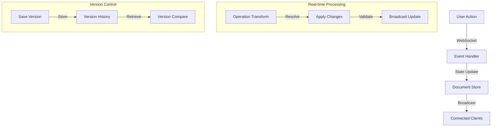

# Collaboration System Documentation
_Version: 1.3.0_
_Last Updated: 2024-02-23_

## Overview
The collaboration system enables real-time document collaboration between users and AI through an integrated chat-based interface. It provides a comprehensive document editing experience with version control, real-time updates, and AI assistance. Each document is managed as a specialized chat session with additional collaboration features.

## Architecture

### System Design


### Component Structure
```
src/lib/components/collaborate/
├── Layout/
│   ├── CollaborateLayout.svelte   # Main collaboration orchestrator
│   └── DocumentLayout.svelte      # Document-specific layout
├── Sidebar/
│   ├── CollaborateSidebar.svelte  # Document management
│   ├── DocumentList.svelte        # Available documents
│   ├── VersionHistory.svelte     # Version timeline
│   └── Participants.svelte       # Active users
├── Document/
│   ├── DocumentView.svelte       # Document container
│   ├── DocumentToolbar.svelte    # Document actions
│   ├── Editor/
│   │   ├── Editor.svelte         # Rich text editor
│   │   ├── Toolbar.svelte       # Formatting tools
│   │   └── Plugins/             # Editor plugins
│   └── Presence/
│       ├── Cursors.svelte       # Collaborative cursors
│       └── Selections.svelte    # User selections
└── Chat/
    ├── DocumentChat.svelte      # Document-specific chat
    └── AIAssistant.svelte      # AI integration
```

## Implementation

### Document Store
```typescript
interface DocumentStore {
    documents: WritableStore<Document[]>;
    activeDocument: WritableStore<ActiveDocument>;
    versions: WritableStore<Version[]>;
    participants: WritableStore<Participant[]>;
    cursors: WritableStore<CursorPosition[]>;
    selections: WritableStore<Selection[]>;
    operations: WritableStore<Operation[]>;
}

interface Document {
    id: string;
    title: string;
    content: string;
    version: number;
    created_at: string;
    updated_at: string;
    owner: string;
    participants: string[];
    is_public: boolean;
    metadata: {
        wordCount: number;
        lastEditor: string;
        comments: number;
        ai_assisted: boolean;
    };
}

interface ActiveDocument {
    document: Document | null;
    loading: boolean;
    error: Error | null;
    dirty: boolean;
    selection: Selection | null;
    cursor: CursorPosition | null;
    participants: Participant[];
}

interface Operation {
    id: string;
    type: 'insert' | 'delete' | 'replace' | 'format';
    position: number;
    content?: string;
    length?: number;
    attributes?: Record<string, any>;
    userId: string;
    timestamp: number;
}

interface Version {
    id: string;
    documentId: string;
    version: number;
    content: string;
    timestamp: string;
    author: string;
    message?: string;
    changes: Operation[];
}

interface Participant {
    id: string;
    name: string;
    avatar?: string;
    color: string;
    active: boolean;
    lastSeen: string;
    cursor?: CursorPosition;
    selection?: Selection;
}
```

### WebSocket Events
```typescript
// Event Types
type DocumentEvent = 
    | { type: 'document:update'; payload: Operation[] }
    | { type: 'cursor:update'; payload: CursorPosition }
    | { type: 'selection:update'; payload: Selection }
    | { type: 'participant:join'; payload: Participant }
    | { type: 'participant:leave'; payload: string }
    | { type: 'version:create'; payload: Version }
    | { type: 'error'; payload: Error };

// Event Handlers
const documentEventHandlers = {
    'document:update': (operations: Operation[]) => {
        // Apply operational transform
        const transformed = transformOperations(operations);
        // Update document state
        applyOperations(transformed);
        // Broadcast to other participants
        broadcastOperations(transformed);
    },
    
    'cursor:update': (position: CursorPosition) => {
        cursors.update(cs => ({
            ...cs,
            [position.userId]: position
        }));
    },
    
    'selection:update': (selection: Selection) => {
        selections.update(ss => ({
            ...ss,
            [selection.userId]: selection
        }));
    }
};

// Socket Management
const initializeSocket = (documentId: string) => {
    const socket = io('/document', {
        auth: { token: getAuthToken() },
        query: { documentId }
    });
    
    // Set up event handlers
    Object.entries(documentEventHandlers).forEach(([event, handler]) => {
        socket.on(event, handler);
    });
    
    // Handle reconnection
    socket.on('reconnect', async () => {
        const operations = await getOperationsSince(lastSyncTimestamp);
        if (operations.length) {
            socket.emit('document:sync', operations);
        }
    });
    
    return socket;
};
```

### Operational Transform
```typescript
interface TransformContext {
    operations: Operation[];
    baseVersion: number;
    serverOperations: Operation[];
}

const transformOperation = (op: Operation, context: TransformContext): Operation[] => {
    const { operations, serverOperations } = context;
    
    // Transform against concurrent operations
    const transformed = operations.reduce((acc, concurrent) => {
        if (concurrent.timestamp < op.timestamp) {
            return transformAgainst(acc, concurrent);
        }
        return acc;
    }, op);
    
    // Handle conflicts
    if (hasConflict(transformed, serverOperations)) {
        return resolveConflict(transformed, serverOperations);
    }
    
    return [transformed];
};

const applyOperation = (doc: Document, op: Operation): Document => {
    switch (op.type) {
        case 'insert':
            return insertText(doc, op.position, op.content!);
        case 'delete':
            return deleteText(doc, op.position, op.length!);
        case 'replace':
            return replaceText(doc, op.position, op.length!, op.content!);
        case 'format':
            return formatText(doc, op.position, op.length!, op.attributes!);
        default:
            throw new Error(`Unknown operation type: ${op.type}`);
    }
};
```

### Version Control
```typescript
interface VersionControl {
    createVersion: (doc: Document, message?: string) => Promise<Version>;
    getVersion: (versionId: string) => Promise<Version>;
    compareVersions: (v1: string, v2: string) => Promise<VersionDiff>;
    revertToVersion: (versionId: string) => Promise<Document>;
}

interface VersionDiff {
    additions: Operation[];
    deletions: Operation[];
    moves: Operation[];
    formatting: Operation[];
}

const versionControl: VersionControl = {
    async createVersion(doc, message) {
        const version: Version = {
            id: generateId(),
            documentId: doc.id,
            version: doc.version + 1,
            content: doc.content,
            timestamp: new Date().toISOString(),
            author: getCurrentUser().id,
            message,
            changes: getOperationsSince(doc.version)
        };
        
        await saveVersion(version);
        return version;
    },
    
    async compareVersions(v1, v2) {
        const [version1, version2] = await Promise.all([
            getVersion(v1),
            getVersion(v2)
        ]);
        
        return diffVersions(version1, version2);
    }
};
```

### Security Implementation
```typescript
interface SecurityConfig {
    permissions: DocumentPermissions;
    encryption: EncryptionConfig;
    rateLimit: RateLimitConfig;
    validation: ValidationConfig;
}

interface DocumentPermissions {
    read: boolean;
    write: boolean;
    manage: boolean;
    share: boolean;
}

// Permission checking
const canPerformOperation = (
    user: User,
    doc: Document,
    operation: Operation
): boolean => {
    // Check basic permissions
    if (!hasPermission(user, doc, 'write')) {
        return false;
    }
    
    // Validate operation
    if (!isValidOperation(operation)) {
        return false;
    }
    
    // Check rate limits
    if (isRateLimited(user, doc)) {
        return false;
    }
    
    return true;
};

// Operation validation
const validateOperation = (op: Operation): ValidationResult => {
    // Sanitize content
    if (op.content) {
        op.content = sanitizeHtml(op.content);
    }
    
    // Validate position
    if (!isValidPosition(op.position)) {
        return { valid: false, error: 'Invalid position' };
    }
    
    // Check operation size
    if (exceedsMaxSize(op)) {
        return { valid: false, error: 'Operation too large' };
    }
    
    return { valid: true };
};
```

## Performance Optimizations

### Document Chunking
```typescript
interface DocumentChunk {
    id: string;
    documentId: string;
    content: string;
    start: number;
    end: number;
    version: number;
}

const chunkSize = 5000; // characters

const loadDocumentChunks = async (
    documentId: string,
    range: { start: number; end: number }
): Promise<DocumentChunk[]> => {
    const startChunk = Math.floor(range.start / chunkSize);
    const endChunk = Math.ceil(range.end / chunkSize);
    
    return await Promise.all(
        range(startChunk, endChunk).map(i =>
            loadChunk(documentId, i)
        )
    );
};
```

### State Management
```typescript
// Efficient store updates
const batchUpdate = (updates: Partial<DocumentStore>) => {
    documentStore.update(store => ({
        ...store,
        ...updates,
        lastUpdated: Date.now()
    }));
};

// Selective subscriptions
const subscribeToDocumentChanges = (
    documentId: string,
    callback: (doc: Document) => void
) => {
    return documentStore.subscribe(({ documents }) => {
        const doc = documents.find(d => d.id === documentId);
        if (doc) {
            callback(doc);
        }
    });
};
```

## Testing

### Unit Tests
```typescript
describe('Document Operations', () => {
    test('insert operation', () => {
        const doc = createTestDocument();
        const op: Operation = {
            type: 'insert',
            position: 0,
            content: 'Hello',
            userId: 'test',
            timestamp: Date.now()
        };
        
        const result = applyOperation(doc, op);
        expect(result.content).toBe('Hello' + doc.content);
    });
    
    test('concurrent operations', async () => {
        const doc = createTestDocument();
        const op1 = createInsertOperation(0, 'Hello');
        const op2 = createInsertOperation(0, 'World');
        
        const transformed = await transformOperations([op1, op2]);
        expect(transformed).toHaveLength(2);
        expect(transformed[1].position).toBe(5);
    });
});
```

### Integration Tests
```typescript
describe('Collaboration System', () => {
    test('real-time updates', async () => {
        // Initialize test document
        const doc = await createDocument();
        
        // Connect two test clients
        const client1 = await connectTestClient(doc.id);
        const client2 = await connectTestClient(doc.id);
        
        // Simulate concurrent edits
        await client1.sendOperation(createInsertOperation(0, 'Hello'));
        await client2.sendOperation(createInsertOperation(5, 'World'));
        
        // Verify final state
        const finalDoc = await getDocument(doc.id);
        expect(finalDoc.content).toBe('HelloWorld');
        
        // Clean up
        await Promise.all([
            client1.disconnect(),
            client2.disconnect(),
            deleteDocument(doc.id)
        ]);
    });
});
```

## Environment Configuration

```bash
# Collaboration System
COLLAB_WS_URL=wss://api.example.com/collab
COLLAB_MAX_PARTICIPANTS=50
COLLAB_CHUNK_SIZE=5000
COLLAB_SYNC_INTERVAL=1000

# Security
COLLAB_E2E_ENABLED=true
COLLAB_AUDIT_ENABLED=true
COLLAB_MAX_DOC_SIZE=10485760

# Performance
COLLAB_CACHE_TTL=3600
COLLAB_BATCH_SIZE=50
COLLAB_DEBOUNCE_MS=100
```

## Best Practices

### 1. Real-time Collaboration
- Implement operational transformation
- Handle concurrent edits gracefully
- Maintain consistent document state
- Provide immediate feedback
- Handle network issues gracefully

### 2. Version Control
- Create versions at meaningful points
- Store efficient diffs
- Implement conflict resolution
- Support version comparison
- Enable selective reverting

### 3. Performance
- Implement document chunking
- Use efficient state updates
- Optimize WebSocket messages
- Cache frequently accessed data
- Handle large documents efficiently

### 4. Security
- Validate all operations
- Implement proper access control
- Use secure WebSocket connections
- Audit all document changes
- Rate limit operations

## Future Improvements

### 1. Editor Features
- Enhanced rich text support
- Better file handling
- Improved code editing
- Advanced formatting options
- Collaborative comments

### 2. Version Control
- Branch support
- Merge capabilities
- Version tagging
- Automated versioning
- Diff visualization

### 3. Performance
- Enhanced caching
- Better state management
- Optimized rendering
- Improved error recovery
- Advanced chunking

### 4. Security
- Enhanced encryption
- Better access control
- Improved audit logging
- Advanced permissions
- Threat detection
