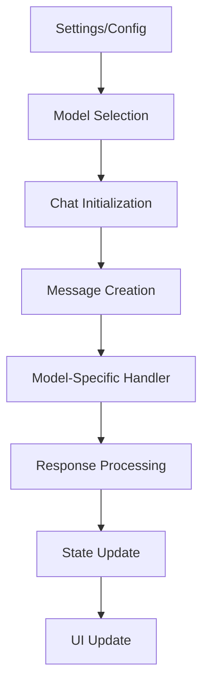

# Model Handling Analysis in Chat Components

## Overview

This document provides a detailed analysis of how models are handled in the chat components of the application, specifically focusing on `Chat.new.svelte` and `Chat.svelte`. The analysis covers architecture, state management, model selection, and integration with different AI providers.

## Core Components

### 1. Chat.new.svelte (New Implementation)

#### Model State Management
- Uses Svelte stores for centralized model state:
  ```typescript
  import { selectedModels, models } from '$lib/stores/ChatStores';
  ```
- Local component state:
  - `atSelectedModel`: Type `Model` for current model selection
  - `selectedModelIds`: Derived from `atSelectedModel` or `selectedModels`

#### Model Selection
- Initializes from settings if available
- Uses dedicated `ModelSelector` component
- Maintains model selection state through Svelte stores
- Supports multi-model selection

#### Architecture
- Modular design with separated concerns
- Delegates model-specific operations to handler files:
  - `ChatLogicHandlers.ts`
  - `ChatResponseHandlers.ts`

### 2. Chat.svelte (Original Implementation)

#### Model State Management
- Uses local component state:
  ```typescript
  let selectedModels = [''];
  let atSelectedModel: Model;
  ```
- Session storage integration for persistence
- Direct model state manipulation

#### Model Selection
- Handles model selection directly in component
- Includes session storage persistence
- Direct implementation of model selection logic

#### Architecture
- Monolithic design with most logic in component
- Contains direct implementations for different model providers
- Includes error handling specific to each model type

## Model Integration

### AI Provider Integration

#### OpenAI Integration
```typescript
const sendPromptOpenAI = async (model, userPrompt, responseMessageId, _chatId) => {
    // Implementation for OpenAI model handling
    // Includes streaming and non-streaming responses
    // Error handling specific to OpenAI
}
```

#### Ollama Integration
```typescript
const sendPromptOllama = async (model, userPrompt, responseMessageId, _chatId) => {
    // Implementation for Ollama model handling
    // Includes message formatting specific to Ollama
    // System prompt handling
}
```

### Model Configuration

#### Model Settings
- Default models configurable through settings
- Model capabilities checking (e.g., vision capabilities)
- Model-specific parameters handling

#### Model Selection Persistence
- Session storage for temporary persistence
- Settings store for long-term persistence
- URL parameter support for model selection

## Handler Functions

### ChatResponseHandlers.ts

Key functionalities:
1. Message formatting for different model types
2. Response streaming management
3. Error handling for different providers
4. Context management (user context, system prompts)

### ChatLogicHandlers.ts

Core responsibilities:
1. Chat initialization with model selection
2. Model state management
3. Message creation and handling
4. Chat persistence and loading

## State Flow



## Key Differences Between Implementations

### 1. Architecture
- **Chat.new.svelte**:
  - Modular and maintainable
  - Clear separation of concerns
  - External handlers for complex logic

- **Chat.svelte**:
  - Monolithic design
  - Self-contained functionality
  - Direct implementation of model logic

### 2. State Management
- **Chat.new.svelte**:
  - Centralized state through stores
  - Reactive updates
  - Better state isolation

- **Chat.svelte**:
  - Local state management
  - Direct state manipulation
  - Tighter coupling between state and UI

### 3. Error Handling
- **Chat.new.svelte**:
  - Centralized error handling
  - Consistent error patterns
  - Delegated to handlers

- **Chat.svelte**:
  - Model-specific error handling
  - Inline error management
  - Direct error state manipulation

## Model Lifecycle

### Initialization
1. **Default Model Loading**
   - Models are loaded from multiple possible sources in order:
     1. URL parameters (`?models=` or `?model=`)
     2. User settings
     3. Config default models
     4. First available model if none specified

2. **Model Validation**
   - Validates that selected models exist in available models list
   - Filters out invalid model IDs
   - Ensures at least one model is selected

### Runtime Behavior
1. **Model Switching**
   - Supports dynamic model switching during chat
   - Maintains chat history across model changes
   - Preserves model-specific parameters

2. **Multi-Model Support**
   - Allows parallel model usage
   - Handles response merging from multiple models
   - Maintains separate contexts per model

### Cleanup
- Proper cleanup of model subscriptions
- Session storage cleanup
- State reset on chat completion

## Model Capabilities

### Feature Detection
```typescript
// Example of model capability checking
const hasImages = messages.some((message) =>
    message.files?.some((file) => file.type === 'image')
);

if (hasImages && !(model.info?.meta?.capabilities?.vision ?? true)) {
    toast.error(
        $i18n.t('Model {{modelName}} is not vision capable', {
            modelName: model.name ?? model.id
        })
    );
}
```

### Supported Features
- Text completion
- Vision capabilities (model-dependent)
- Streaming responses
- System prompts
- Context management
- Memory integration

## Model-Specific Parameters

### OpenAI Models
- Temperature control
- Max tokens
- Top P
- Frequency penalty
- Presence penalty
- Stream response toggle

### Ollama Models
- System prompt handling
- Context window management
- Custom model parameters
- Response formatting

## Memory Integration

### Per-Model Context
```typescript
if ($settings?.memory ?? false) {
    if (userContext === null) {
        const res = await queryMemory(localStorage.token, prompt);
        if (res?.documents[0].length > 0) {
            userContext = res.documents[0].reduce((acc, doc, index) => {
                const createdAtTimestamp = res.metadatas[0][index].created_at;
                const createdAtDate = new Date(createdAtTimestamp * 1000)
                    .toISOString()
                    .split('T')[0];
                return `${acc}${index + 1}. [${createdAtDate}]. ${doc}\n`;
            }, '');
        }
    }
}
```

### Context Management
- Per-model memory storage
- Context window optimization
- Memory query integration
- Timestamp-based context organization

## Error Handling Patterns

### Network Errors
```typescript
try {
    const response = await generateChatCompletion(/* params */);
    // Handle success
} catch (error) {
    if (error.response?.status === 401) {
        // Handle authentication error
    } else if (error.response?.status === 429) {
        // Handle rate limiting
    } else {
        // Handle general error
    }
}
```

### Model-Specific Errors
- Token limit exceeded
- Invalid model parameters
- Capability mismatches
- Rate limiting

## Performance Considerations

### Response Streaming
- Chunked response handling
- Progressive UI updates
- Memory efficient processing

### State Management
- Efficient model switching
- Optimized context updates
- Minimal re-renders

## Implementation Examples

### Model Selection
```typescript
// Chat.new.svelte
selectedModels.subscribe((models) => {
    // Handle model selection changes
    updateModelCapabilities();
    resetChatIfNeeded();
});

// Chat.svelte
$: selectedModels = selectedModels.filter(modelId => 
    $models.map(m => m.id).includes(modelId)
);
```

### Response Processing
```typescript
// Streaming response handler
const handleStreamingResponse = async (response, messageId) => {
    const reader = response.body.getReader();
    const decoder = new TextDecoder();
    
    while (true) {
        const { done, value } = await reader.read();
        if (done) break;
        
        const chunk = decoder.decode(value);
        await processChunk(chunk, messageId);
    }
};
```

## Best Practices and Recommendations

1. **State Management**
   - Use Svelte stores for global model state
   - Keep model selection state centralized
   - Implement proper cleanup for subscriptions

2. **Error Handling**
   - Implement consistent error patterns
   - Handle model-specific errors appropriately
   - Provide clear error feedback to users

3. **Model Selection**
   - Support multiple model selection
   - Implement proper model capability checking
   - Maintain model selection persistence

4. **Code Organization**
   - Separate model logic from UI components
   - Use dedicated handlers for complex operations
   - Maintain clear boundaries between concerns

## Future Improvements

1. **TypeScript Integration**
   - Strengthen type definitions for models
   - Implement proper interfaces for model handlers
   - Improve type safety in message handling

2. **Testing**
   - Add unit tests for model handlers
   - Implement integration tests for model selection
   - Test error scenarios thoroughly

3. **Performance**
   - Optimize model switching
   - Improve response handling efficiency
   - Implement better caching for model data

4. **Documentation**
   - Add comprehensive JSDoc comments
   - Document model capabilities
   - Maintain up-to-date API documentation
