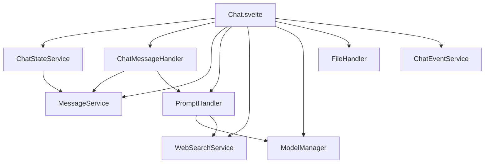

# Chat Application Services Documentation

## Overview
This document details the service-based architecture implemented in the chat application. The services are designed to handle specific aspects of the application's functionality, promoting separation of concerns and maintainability.

## Service Architecture

### ChatStateService
**Purpose**: Manages the overall state of the chat application.

**Key Responsibilities**:
- Initializes new chat sessions
- Manages chat history and messages
- Handles chat persistence
- Manages chat parameters and files

**Key Methods**:
```typescript
initChatHandler(): Promise<void>
saveChatHandler(chatId: string): Promise<void>
createMessagesList(parentId: string | null): Message[]
generateAndSaveTags(messages: Message[], chatId: string): Promise<void>
```

### ChatMessageHandler
**Purpose**: Handles all message-related operations and interactions.

**Key Responsibilities**:
- Message submission and processing
- Response generation and regeneration
- Message continuation
- Window message handling

**Key Methods**:
```typescript
submitMessage(parentId: string, prompt: string): Promise<void>
regenerateResponse(message: Message): Promise<void>
continueResponse(): Promise<void>
handleWindowMessage(event: MessageEvent): Promise<string | void>
showMessage(message: Message): Promise<void>
```

### MessageService
**Purpose**: Provides core message manipulation functionality.

**Key Responsibilities**:
- Creates new messages
- Updates existing messages
- Manages message relationships
- Handles message deletion

**Key Methods**:
```typescript
createUserMessage(content: string, parentId?: string): Message
updateMessage(messageId: string, updates: Partial<Message>): Message | null
deleteMessage(messageId: string): void
getMessagesList(responseMessageId: string | null): Message[]
```

### PromptHandler
**Purpose**: Manages prompt generation and model interactions.

**Key Responsibilities**:
- Handles prompt formatting
- Manages model-specific prompt generation
- Processes model responses
- Handles streaming responses

**Key Methods**:
```typescript
generatePrompt(messages: Message[]): Promise<string>
handleModelResponse(response: any): Promise<void>
processStreamingResponse(stream: ReadableStream): Promise<void>
```

### WebSearchService
**Purpose**: Handles web search functionality integration.

**Key Responsibilities**:
- Performs web searches
- Processes search results
- Integrates results with chat context

**Key Methods**:
```typescript
getWebSearchResults(model: string, parentId: string, responseMessageId: string): Promise<any>
processSearchResults(results: any[]): Promise<void>
```

### ModelManager
**Purpose**: Manages AI model selection and configuration.

**Key Responsibilities**:
- Handles model selection
- Manages model configurations
- Controls tool integration
- Manages web search settings

**Key Methods**:
```typescript
setSelectedModels(models: string[]): void
getCurrentModel(): Model | undefined
setWebSearchEnabled(enabled: boolean): void
getSelectedToolIds(): string[]
```

### FileHandler
**Purpose**: Manages file operations and processing.

**Key Responsibilities**:
- Handles file uploads
- Processes different file types
- Manages file state
- Handles web and YouTube content

**Key Methods**:
```typescript
handleFileUpload(files: FileList, messageId: string): Promise<void>
readFileAsText(file: File): Promise<string>
createWebFileItem(url: string): Promise<FileItem>
processWeb(url: string): Promise<any>
```

### ChatEventService
**Purpose**: Manages real-time chat events and WebSocket communication.

**Key Responsibilities**:
- Handles WebSocket events
- Manages chat event processing
- Handles event confirmations
- Processes action events

**Key Methods**:
```typescript
handleEvent(event: ChatEvent, callback?: (result: any) => void): Promise<void>
handleStatusEvent(message: Message, data: any): void
handleSourceEvent(message: Message, data: any): void
handleActionEvent(data: any): void
```

## Service Dependencies



## Service Initialization Order

1. ModelManager (no dependencies)
2. WebSearchService (requires token)
3. MessageService (requires history)
4. PromptHandler (requires history)
5. ChatMessageHandler (requires history, MessageService, PromptHandler)
6. FileHandler (requires history)
7. ChatEventService (requires socket)
8. ChatStateService (requires token, history, models, params, files)

## Best Practices

1. **Service Communication**:
   - Services should communicate through well-defined interfaces
   - Avoid direct manipulation of other services' internal state
   - Use callbacks or events for asynchronous operations

2. **State Management**:
   - Services should manage their own internal state
   - State updates should be atomic and consistent
   - Use appropriate error handling for state modifications

3. **Error Handling**:
   - Services should handle their own errors appropriately
   - Errors should be propagated up the chain when necessary
   - Use type-safe error handling where possible

4. **Performance**:
   - Services should be lazy-loaded when possible
   - Heavy operations should be asynchronous
   - Cache results when appropriate

## Future Improvements

1. **Type Safety**:
   - Add comprehensive TypeScript interfaces for all service methods
   - Implement strict type checking across service boundaries
   - Add runtime type validation for critical operations

2. **Testing**:
   - Add unit tests for each service
   - Implement integration tests for service interactions
   - Add performance benchmarks for critical operations

3. **Documentation**:
   - Add JSDoc comments for all public methods
   - Create usage examples for common scenarios
   - Document service interaction patterns

4. **Monitoring**:
   - Add telemetry for service performance
   - Implement error tracking and reporting
   - Add usage analytics for service methods
