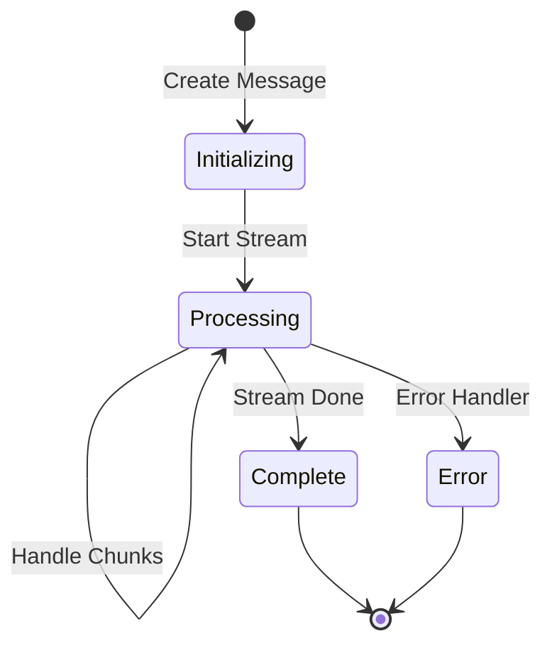

# Streaming Implementation

This document describes the streaming implementation in the chat system. For related documentation, see:
- [Type Definitions](types.md)
- [Store Management](stores.md)

## Overview
The chat system uses Server-Sent Events (SSE) for real-time message streaming. The implementation handles:
- Stream processing and decoding
- Message state updates
- Error handling
- UI updates

## Stream Processing Flow

### Pipeline Architecture
```
[API Response] → [TextDecoder] → [EventSource Parser] → [Delta Processor] → [UI Update]
     ↑               ↑                ↑                    ↑                 ↑
     └── Network ────┴── Decoding ────┴── Event Parsing ──┴── State ────────┘
```

### Message State Flow


## Implementation Details

### Stream Processing

### Core Pipeline
```typescript
const reader = res.body
  .pipeThrough(new TextDecoderStream())
  .pipeThrough(splitStream('\n'))
  .getReader();
```

### Message Processing
```typescript
try {
  let lines = value.split('\n');
  for (const line of lines) {
    if (line !== '') {
      let data = JSON.parse(line.replace(/^data: /, ''));
      // Process data and update message content
      responseMessage.content += data.choices[0].delta.content ?? '';
      messages = messages;
      await tick();
    }
  }
} catch (error) {
  console.log(error);
}
```

### Response Handling
The application handles different types of streaming responses:

1. Regular content updates:
```typescript
responseMessage.content += data.choices[0].delta.content ?? '';
```

2. Completion signal:
```typescript
if (line === 'data: [DONE]') {
  responseMessage.done = true;
  messages = messages;
}
```

3. Error handling:
```typescript
if (res && res.ok) {
  // Process stream
} else {
  if (res !== null) {
    const error = await res.json();
    if ('detail' in error) {
      toast.error(error.detail);
      responseMessage.error = { content: error.detail };
    } else {
      toast.error(error.error);
      responseMessage.error = { content: error.error };
    }
  } else {
    toast.error(
      $i18n.t(`Uh-oh! There was an issue connecting to {{provider}}.`, { provider: 'Ollama' })
    );
    responseMessage.error = {
      content: $i18n.t(`Uh-oh! There was an issue connecting to {{provider}}.`, {
        provider: 'Ollama'
      })
    };
  }
  responseMessage.done = true;
}
```

### UI Updates
The UI is updated in real-time as new content arrives:

1. Content updates trigger re-renders:
```typescript
messages = messages; // Trigger Svelte reactivity
await tick(); // Ensure DOM is updated
```

2. Automatic scrolling:
```typescript
scrollToBottom();
```

3. Post-completion actions:
```typescript
// Notification if window not focused
if ($settings.notificationEnabled && !document.hasFocus()) {
  const notification = new Notification(`${model.id}`, {
    body: responseMessage.content,
    icon: `${WEBUI_BASE_URL}/static/favicon.png`
  });
}

// Auto-copy response if enabled
if ($settings.responseAutoCopy) {
  copyToClipboard(responseMessage.content);
}

// Auto-playback if enabled and not in call
if ($settings.responseAutoPlayback && !$showCallOverlay) {
  await tick();
  document.getElementById(`speak-button-${responseMessage.id}`)?.click();
}
```

### Resource Cleanup
The application ensures proper cleanup of resources:

```typescript
try {
  // Process stream
} finally {
  // Ensure cleanup happens regardless of success/failure
  if (stopResponseFlag) {
    controller.abort('User: Stop Response');
  }
  responseMessage.done = true;
}
```

## Store Integration

### Store Dependencies
The streaming implementation integrates with several core stores:

```typescript
// Required stores
import { messages } from '$lib/stores/messages';
import { settings } from '$lib/stores/settings';
import { config } from '$lib/stores/config';
import { showCallOverlay } from '$lib/stores/ui';
```

### Message Store Updates
Messages are updated reactively as new content arrives:

```typescript
// Update message content
responseMessage.content += data.choices[0].delta.content ?? '';
messages = messages; // Trigger Svelte reactivity

// Update message status
responseMessage.done = true;
messages = messages;

// Handle errors
responseMessage.error = { content: error.detail };
messages = messages;
```

### Settings Integration
The streaming behavior is influenced by user settings:

```typescript
// Auto-copy setting
if ($settings.responseAutoCopy) {
  copyToClipboard(responseMessage.content);
}

// Auto-playback setting
if ($settings.responseAutoPlayback && !$showCallOverlay) {
  await tick();
  document.getElementById(`speak-button-${responseMessage.id}`)?.click();
}

// Notification setting
if ($settings.notificationEnabled && !document.hasFocus()) {
  const notification = new Notification(`${model.id}`, {
    body: responseMessage.content,
    icon: `${WEBUI_BASE_URL}/static/favicon.png`
  });
}
```

### Event Handling
Events are dispatched to notify components of updates:

```typescript
// Dispatch chat event with new content
eventTarget.dispatchEvent(
  new CustomEvent('chat', {
    detail: { id: responseMessageId, content: lastMessageContentPart }
  })
);

// Dispatch completion event
eventTarget.dispatchEvent(
  new CustomEvent('chat:finish', {
    detail: {
      id: responseMessageId,
      content: responseMessage.content
    }
  })
);
```

## Type Definitions

### Message Types
```typescript
interface Message {
  id: string;
  parentId: string;
  content: string;
  model: string;
  selectedModelId?: string;
  done: boolean;
  error?: {
    content: string;
  };
  info?: {
    eval_count?: number;
    eval_duration?: number;
    load_duration?: number;
    prompt_eval_count?: number;
    prompt_eval_duration?: number;
    total_duration?: number;
  };
  timestamp: number;
  childrenIds: string[];
  annotation?: {
    rating?: number;
    tags?: string[];
  };
}

interface MessageHistory {
  messages: Record<string, Message>;
  currentId: string;
}
```

### Stream Response Types
```typescript
interface StreamResponse {
  choices?: [{
    delta: {
      content?: string;
    };
  }];
  usage?: {
    prompt_tokens: number;
    completion_tokens: number;
    total_tokens: number;
  };
  error?: {
    detail?: string;
    error?: string;
  };
}
```

### Event Types
```typescript
interface ChatEvent extends CustomEvent {
  detail: {
    id: string;
    content: string;
  };
}

interface ChatFinishEvent extends CustomEvent {
  detail: {
    id: string;
    content: string;
  };
}
```

## Error Handling

### Response Error Handling
The application handles various types of errors that can occur during streaming:

```typescript
if (res && res.ok) {
  // Process stream
} else {
  if (res !== null) {
    const error = await res.json();
    if ('detail' in error) {
      toast.error(error.detail);
      responseMessage.error = { content: error.detail };
    } else {
      toast.error(error.error);
      responseMessage.error = { content: error.error };
    }
  } else {
    toast.error(
      $i18n.t(`Uh-oh! There was an issue connecting to {{provider}}.`, { provider: 'Ollama' })
    );
    responseMessage.error = {
      content: $i18n.t(`Uh-oh! There was an issue connecting to {{provider}}.`, {
        provider: 'Ollama'
      })
    };
  }
  responseMessage.done = true;
}
```

### Stream Processing Errors
Errors during stream processing are caught and logged:

```typescript
try {
  let lines = value.split('\n');
  for (const line of lines) {
    if (line !== '') {
      let data = JSON.parse(line.replace(/^data: /, ''));
      // Process data
    }
  }
} catch (error) {
  console.log(error);
}
```

### User Interruption
The application handles user-initiated stream interruption:

```typescript
if (done || stopResponseFlag) {
  if (stopResponseFlag) {
    controller.abort('User: Stop Response');
  }
  break;
}
```

### Resource Cleanup
Proper cleanup is ensured in both success and error cases:

```typescript
try {
  // Process stream
} finally {
  // Ensure cleanup happens regardless of success/failure
  if (stopResponseFlag) {
    controller.abort('User: Stop Response');
  }
  responseMessage.done = true;
}
```

## User Experience Features

### Auto-Scrolling
```typescript
scrollToBottom();
```

### Notifications
```typescript
if ($settings.notificationEnabled && !document.hasFocus()) {
  const notification = new Notification(`${model.id}`, {
    body: responseMessage.content,
    icon: `${WEBUI_BASE_URL}/static/favicon.png`
  });
}
```

### Response Actions
```typescript
// Auto-copy if enabled
if ($settings.responseAutoCopy) {
  copyToClipboard(responseMessage.content);
}

// Auto-playback if enabled
if ($settings.responseAutoPlayback && !$showCallOverlay) {
  await tick();
  document.getElementById(`speak-button-${responseMessage.id}`)?.click();
}
```

## Best Practices

### Performance Optimization

1. Efficient Stream Processing
```typescript
// Use TextDecoderStream for efficient UTF-8 decoding
const reader = res.body
  .pipeThrough(new TextDecoderStream())
  .pipeThrough(splitStream('\n'))
  .getReader();
```

2. Reactive Updates
```typescript
// Update message content and trigger reactivity
responseMessage.content += data.choices[0].delta.content ?? '';
messages = messages;
await tick();
```

3. Visibility-Aware Processing
```typescript
// Check document visibility for optimizations
if (document?.visibilityState !== 'hidden') {
  await sleep(5);
}
```

### Error Handling

1. Comprehensive Error Catching
```typescript
try {
  let data = JSON.parse(line.replace(/^data: /, ''));
  // Process data
} catch (error) {
  console.log(error);
}
```

2. User Feedback
```typescript
// Provide clear error messages
toast.error(
  $i18n.t(`Uh-oh! There was an issue connecting to {{provider}}.`, { provider: 'Ollama' })
);
```

3. Resource Cleanup
```typescript
if (stopResponseFlag) {
  controller.abort('User: Stop Response');
}
```

### User Experience

1. Auto-Scrolling
```typescript
scrollToBottom();
```

2. Notifications
```typescript
if ($settings.notificationEnabled && !document.hasFocus()) {
  const notification = new Notification(`${model.id}`, {
    body: responseMessage.content,
    icon: `${WEBUI_BASE_URL}/static/favicon.png`
  });
}
```

3. Response Actions
```typescript
// Auto-copy if enabled
if ($settings.responseAutoCopy) {
  copyToClipboard(responseMessage.content);
}

// Auto-playback if enabled
if ($settings.responseAutoPlayback && !$showCallOverlay) {
  await tick();
  document.getElementById(`speak-button-${responseMessage.id}`)?.click();
}
```

### Code Organization

1. Clear Type Definitions
```typescript
interface Message {
  id: string;
  content: string;
  done: boolean;
  error?: { content: string };
  // ...other fields
}
```

2. Event-Based Communication
```typescript
eventTarget.dispatchEvent(
  new CustomEvent('chat:finish', {
    detail: {
      id: responseMessageId,
      content: responseMessage.content
    }
  })
);
```

3. Modular Stream Processing
```typescript
// Split stream processing into clear steps
.pipeThrough(new TextDecoderStream())
.pipeThrough(splitStream('\n'))
.getReader();
```

## Testing

### Unit Tests

1. Stream Processing Tests
```typescript
describe('Stream Processing', () => {
  test('processes valid stream data', () => {
    const data = {
      choices: [{
        delta: {
          content: 'test content'
        }
      }]
    };
    
    const line = `data: ${JSON.stringify(data)}`;
    const result = processStreamLine(line);
    expect(result.content).toBe('test content');
  });

  test('handles empty delta content', () => {
    const data = {
      choices: [{
        delta: {}
      }]
    };
    
    const line = `data: ${JSON.stringify(data)}`;
    const result = processStreamLine(line);
    expect(result.content).toBe('');
  });

  test('identifies stream completion', () => {
    const line = 'data: [DONE]';
    const result = processStreamLine(line);
    expect(result.done).toBe(true);
  });
});
```

2. Error Handling Tests
```typescript
describe('Error Handling', () => {
  test('handles invalid JSON', () => {
    const line = 'data: invalid json';
    expect(() => processStreamLine(line)).not.toThrow();
  });

  test('handles API errors', () => {
    const error = {
      detail: 'API Error'
    };
    
    const response = {
      ok: false,
      json: async () => error
    };
    
    const result = handleStreamError(response);
    expect(result.error.content).toBe('API Error');
  });

  test('handles connection errors', () => {
    const response = null;
    const result = handleStreamError(response);
    expect(result.error.content).toContain('issue connecting');
  });
});
```

3. Message Store Tests
```typescript
describe('Message Store', () => {
  test('updates message content', () => {
    const message = {
      id: 'test',
      content: '',
      done: false
    };
    
    updateMessageContent(message, 'new content');
    expect(message.content).toBe('new content');
  });

  test('marks message as complete', () => {
    const message = {
      id: 'test',
      content: 'content',
      done: false
    };
    
    completeMessage(message);
    expect(message.done).toBe(true);
  });
});
```

### Integration Tests

1. End-to-End Stream Tests
```typescript
describe('Streaming E2E', () => {
  test('processes complete stream', async () => {
    const stream = mockStreamResponse([
      'Hello',
      ' World',
      '[DONE]'
    ]);
    
    const message = await processStream(stream);
    expect(message.content).toBe('Hello World');
    expect(message.done).toBe(true);
  });

  test('handles stream interruption', async () => {
    const stream = mockStreamResponse([
      'Hello',
      ' World'
    ]);
    
    const controller = new AbortController();
    setTimeout(() => controller.abort(), 100);
    
    const message = await processStream(stream, controller.signal);
    expect(message.content).toBe('Hello World');
    expect(message.done).toBe(true);
  });
});
```

2. UI Integration Tests
```typescript
describe('UI Integration', () => {
  test('updates UI on new content', async () => {
    const { container } = render(StreamingComponent);
    const message = container.querySelector('.message-content');
    
    await simulateStream('Hello World');
    expect(message.textContent).toBe('Hello World');
  });

  test('shows error message on failure', async () => {
    const { container } = render(StreamingComponent);
    const error = container.querySelector('.error-message');
    
    await simulateStreamError('API Error');
    expect(error.textContent).toContain('API Error');
  });
});
```

## Core Components

### Stream Processing Pipeline
```
[API Response] → [Stream Reader] → [Chunk Parser] → [Event Dispatcher] → [UI Update]
     ↑               ↑                ↑                ↑                 ↑
     └── Network ────┴── Processing ──┴── Events ──────┴── State ───────┘
```

### Message State Management


## Implementation Examples

### 1. Stream Initialization
```typescript
const [response, controller] = await generateOpenAIChatCompletion(token, {
  messages: messages,
  stream: true,
  ...params
});

const reader = response.body
  .pipeThrough(new TextDecoderStream())
  .getReader();
```

### 2. Stream Processing
```typescript
const processStreamingResponse = async (
  reader: ReadableStreamDefaultReader,
  onChunk: (chunk: string) => void,
  onDone: () => void
) => {
  try {
    const lines = splitStream(chunk);
    for (const line of lines) {
      const content = line.replace(/^data: /, '');
      if (content === '[DONE]') {
        history.messages[responseMessageId].done = true;
        return;
      }
      
      const json = JSON.parse(content);
      if (json.message) {
        history.messages[responseMessageId].content += json.message;
        
        // Handle haptic feedback
        if (navigator.vibrate && settings?.hapticFeedback) {
          navigator.vibrate(5);
        }

        // Process message parts for TTS
        const messageContentParts = getMessageContentParts(
          history.messages[responseMessageId].content,
          config?.audio?.tts?.split_on ?? 'punctuation'
        );
        
        // Dispatch events for new content
        dispatchMessageEvents(messageContentParts);
      }
      
      // Update usage info if available
      if (json.usage) {
        history.messages[responseMessageId].info = json.usage;
      }
    }
  } catch (err) {
    console.error('Error processing chunk:', err);
  }
};
```

### 3. Event Handling
```typescript
const dispatchMessageEvents = (messageContentParts: string[]) => {
  // Remove last incomplete part
  messageContentParts.pop();
  
  // Dispatch only new complete sentences
  if (messageContentParts.length > 0) {
    const lastPart = messageContentParts[messageContentParts.length - 1];
    if (lastPart !== history.messages[responseMessageId].lastSentence) {
      history.messages[responseMessageId].lastSentence = lastPart;
      eventTarget.dispatchEvent(
        new CustomEvent('chat', {
          detail: {
            id: responseMessageId,
            content: lastPart
          }
        })
      );
    }
  }
};
```

### 4. Error Handling

#### Network Errors
```typescript
try {
  const response = await fetch(url, {
    method: 'POST',
    headers: headers,
    body: JSON.stringify(body)
  });
  
  if (!response.ok) {
    throw new Error(`HTTP error! status: ${response.status}`);
  }
  
  return response;
} catch (error) {
  console.error('Network error:', error);
  throw error;
}
```

#### Stream Processing Errors
```typescript
const handleStreamError = (error: Error) => {
  history.messages[responseMessageId].isError = true;
  history.messages[responseMessageId].content = error.message;
  history.messages[responseMessageId].done = true;
  
  // Notify UI of error
  eventTarget.dispatchEvent(
    new CustomEvent('error', {
      detail: {
        id: responseMessageId,
        error: error
      }
    })
  );
};
```

## Accessibility Features

### 1. Live Regions
```typescript
// Create live region for screen readers
const liveRegion = document.createElement('div');
liveRegion.setAttribute('aria-live', 'polite');
liveRegion.setAttribute('role', 'status');
liveRegion.style.position = 'absolute';
liveRegion.style.width = '1px';
liveRegion.style.height = '1px';
liveRegion.style.padding = '0';
liveRegion.style.margin = '-1px';
liveRegion.style.overflow = 'hidden';
liveRegion.style.clip = 'rect(0, 0, 0, 0)';
liveRegion.style.whiteSpace = 'nowrap';
liveRegion.style.border = '0';
document.body.appendChild(liveRegion);

// Update live region with new content
const updateLiveRegion = (content: string) => {
  liveRegion.textContent = content;
};
```

### 2. Keyboard Control
```typescript
const handleKeyboardControl = (event: KeyboardEvent) => {
  if (event.key === 'Escape') {
    controller.abort();
    history.messages[responseMessageId].done = true;
  }
};

document.addEventListener('keydown', handleKeyboardControl);
```

### 3. Progress Indicators
```typescript
const updateProgress = (processed: number, total: number) => {
  const progress = document.getElementById('stream-progress');
  if (progress) {
    progress.setAttribute('aria-valuenow', String(processed));
    progress.setAttribute('aria-valuemax', String(total));
    progress.style.width = `${(processed / total) * 100}%`;
  }
};
```

For more information about the chat system implementation, see [chat.md](../chat.md).
