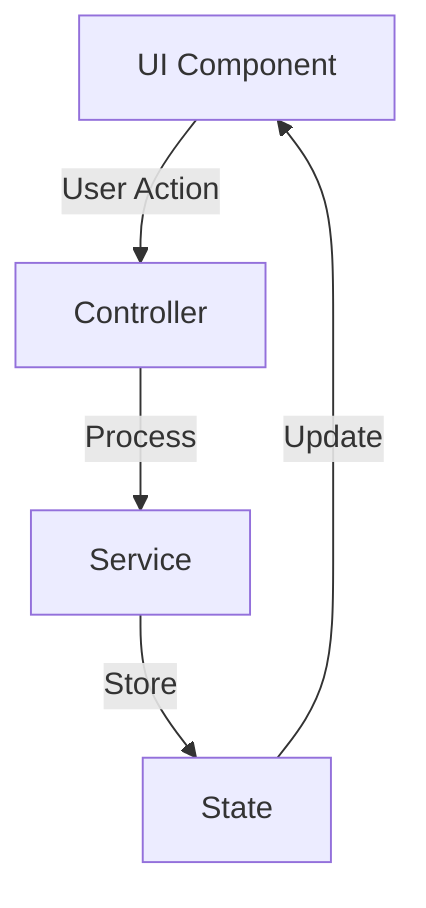

# Feature Documentation Template

## Overview
Brief description of the feature and its purpose in the application.

### Key Capabilities
- Capability 1
- Capability 2
- Capability 3

### User Benefits
- Benefit 1
- Benefit 2
- Benefit 3

## Getting Started
### Prerequisites
- Required setup
- Dependencies
- Permissions

### Quick Start
```typescript
// Minimal example to get started
import { Feature } from '$lib/features/feature';

const feature = new Feature();
await feature.initialize();
```

## Feature Components

### Core Components


### Component Details
#### UI Components
- `FeatureComponent.svelte`
- `FeatureDialog.svelte`
- `FeatureList.svelte`

#### Controllers
- `FeatureController.ts`
- `FeatureValidator.ts`

#### Services
- `FeatureService.ts`
- `FeatureAPI.ts`

#### State Management
- `FeatureStore.ts`
- `FeatureActions.ts`

## Usage Guide

### Basic Usage
```typescript
import { Feature } from '$lib/features/feature';
import type { FeatureConfig } from '$lib/features/types';

const config: FeatureConfig = {
    enabled: true,
    mode: 'standard',
    options: {
        // Feature-specific options
    }
};

const feature = new Feature(config);

// Initialize the feature
await feature.initialize();

// Use the feature
const result = await feature.process();
```

### Advanced Usage
```typescript
// Advanced configuration
const advancedConfig: FeatureConfig = {
    enabled: true,
    mode: 'advanced',
    options: {
        customOption1: 'value1',
        customOption2: 'value2'
    },
    callbacks: {
        onSuccess: (result) => {
            console.log('Operation successful:', result);
        },
        onError: (error) => {
            console.error('Operation failed:', error);
        }
    }
};

// Advanced usage example
try {
    const feature = new Feature(advancedConfig);
    await feature.initialize();
    
    // Custom operation
    const result = await feature.processWithOptions({
        // Operation-specific options
    });
    
    // Handle result
    console.log('Operation completed:', result);
} catch (error) {
    console.error('Error during operation:', error);
}
```

## Configuration Options

### Basic Configuration
```typescript
interface FeatureConfig {
    enabled: boolean;
    mode: 'standard' | 'advanced';
    options: {
        setting1?: string;
        setting2?: number;
    };
}
```

### Advanced Configuration
```typescript
interface AdvancedFeatureConfig extends FeatureConfig {
    callbacks?: {
        onSuccess?: (result: any) => void;
        onError?: (error: Error) => void;
        onProgress?: (progress: number) => void;
    };
    validation?: {
        rules: ValidationRule[];
        mode: 'strict' | 'lenient';
    };
}
```

## State Management

### Store Structure
```typescript
interface FeatureState {
    isInitialized: boolean;
    isProcessing: boolean;
    data: {
        items: FeatureItem[];
        selectedItem?: FeatureItem;
    };
    error?: Error;
}
```

### Store Actions
```typescript
// Action creators
const actions = {
    initialize: () => ({
        type: 'INITIALIZE'
    }),
    setData: (data: FeatureData) => ({
        type: 'SET_DATA',
        payload: data
    }),
    setError: (error: Error) => ({
        type: 'SET_ERROR',
        payload: error
    })
};
```

## Event Handling

### Available Events
| Event | Description | Payload |
|-------|-------------|---------|
| `feature:initialized` | Feature initialization complete | `{ timestamp: number }` |
| `feature:processing` | Processing started | `{ id: string }` |
| `feature:completed` | Processing completed | `{ id: string, result: any }` |
| `feature:error` | Error occurred | `{ error: Error }` |

### Event Handling Example
```typescript
import { events } from '$lib/features/feature';

// Subscribe to events
events.on('feature:initialized', (data) => {
    console.log('Feature initialized:', data);
});

events.on('feature:error', (data) => {
    console.error('Feature error:', data.error);
});
```

## Error Handling

### Common Errors
| Error | Cause | Solution |
|-------|-------|----------|
| `FeatureNotInitialized` | Feature used before initialization | Call `initialize()` first |
| `InvalidConfiguration` | Invalid config provided | Check configuration object |
| `ProcessingError` | Error during processing | Check input data and try again |

### Error Handling Example
```typescript
try {
    await feature.process();
} catch (error) {
    if (error instanceof FeatureNotInitialized) {
        // Handle initialization error
        await feature.initialize();
        await feature.process();
    } else if (error instanceof InvalidConfiguration) {
        // Handle configuration error
        console.error('Invalid configuration:', error.details);
    } else {
        // Handle other errors
        console.error('Unexpected error:', error);
    }
}
```

## Testing

### Unit Tests
```typescript
describe('Feature', () => {
    let feature: Feature;
    
    beforeEach(() => {
        feature = new Feature(defaultConfig);
    });
    
    it('should initialize correctly', async () => {
        await feature.initialize();
        expect(feature.isInitialized).toBe(true);
    });
    
    it('should handle invalid config', async () => {
        feature = new Feature(invalidConfig);
        await expect(feature.initialize()).rejects.toThrow(InvalidConfiguration);
    });
});
```

### Integration Tests
```typescript
describe('Feature Integration', () => {
    it('should work with other components', async () => {
        const feature = new Feature(config);
        const otherComponent = new OtherComponent();
        
        await feature.initialize();
        await otherComponent.initialize();
        
        const result = await feature.processWithComponent(otherComponent);
        expect(result).toBeDefined();
    });
});
```

## Performance Considerations
- Resource usage guidelines
- Optimization tips
- Caching strategies
- Memory management

## Security Considerations
- Authentication requirements
- Authorization checks
- Data validation
- Input sanitization

## Best Practices
1. Always initialize before use
2. Handle errors appropriately
3. Clean up resources when done
4. Follow type safety guidelines
5. Implement proper validation

## Related Documentation
- [Technical Documentation](../technical/README.md)
- [API Documentation](../api/README.md)
- [Architecture Guide](../architecture/README.md)

## Navigation
> Documentation / Features / [Feature Name]

- [Documentation Home](../index.md)
- [Features Overview](README.md)
- [Contributing](../CONTRIBUTING.md)
