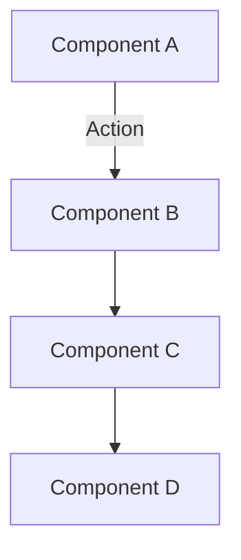

# Technical Documentation Template

## Overview
Brief description of the technical component or system being documented.

### Key Features
- Feature 1 description
- Feature 2 description
- Feature 3 description

### Prerequisites
- Required dependencies
- Environment setup
- Access permissions

## Implementation Details
### Architecture


### Core Concepts
- Key technical concepts
- Design patterns used
- Implementation choices
- Technical constraints

### Component Structure
```
src/lib/components/feature/
├── FeatureMain.svelte    # Main component
├── FeatureStore.ts       # State management
├── types/                # Type definitions
└── utils/                # Utility functions
```

### Configuration
```typescript
interface FeatureConfig {
    enabled: boolean;
    options: {
        setting1: string;
        setting2: number;
    };
    callbacks?: {
        onSuccess?: () => void;
        onError?: (error: Error) => void;
    };
}
```

## Usage Examples
### Basic Usage
```typescript
import { Feature } from '$lib/components/feature';

const feature = new Feature({
    enabled: true,
    options: {
        setting1: 'value1',
        setting2: 42
    }
});

// Example usage
await feature.initialize();
const result = await feature.process();
```

### Advanced Usage
```typescript
// Advanced implementation example
const advancedFeature = new Feature({
    // Configuration
    enabled: true,
    options: {
        setting1: 'custom',
        setting2: 100
    },
    callbacks: {
        onSuccess: () => console.log('Success'),
        onError: (error) => console.error('Error:', error)
    }
});

// Usage with error handling
try {
    await advancedFeature.processWithOptions({
        // Options
    });
} catch (error) {
    // Error handling
}
```

## Performance Considerations
### Optimization Guidelines
- Performance best practices
- Resource usage guidelines
- Caching strategies
- Memory management

### Benchmarks
```typescript
// Performance test example
const benchmark = async () => {
    const start = performance.now();
    // Operation to measure
    const end = performance.now();
    return end - start;
};
```

## Error Handling
### Common Errors
| Error | Cause | Solution |
|-------|-------|----------|
| Error1 | Cause1 | Solution1 |
| Error2 | Cause2 | Solution2 |

### Error Recovery
```typescript
try {
    // Operation that might fail
} catch (error) {
    if (error instanceof SpecificError) {
        // Handle specific error
    } else {
        // Generic error handling
    }
}
```

## Security Considerations
### Best Practices
- Authentication requirements
- Authorization checks
- Data validation
- Input sanitization

### Security Examples
```typescript
// Security implementation example
const secureOperation = async (input: string): Promise<void> => {
    // Input validation
    validateInput(input);
    
    // Authorization check
    await checkAuthorization();
    
    // Secure operation
    await performSecureOperation(input);
};
```

## Testing
### Test Coverage
- Unit tests
- Integration tests
- Performance tests
- Security tests

### Test Examples
```typescript
describe('Feature', () => {
    it('should handle basic operation', async () => {
        const feature = new Feature(config);
        const result = await feature.process();
        expect(result).toBeDefined();
    });
    
    it('should handle errors', async () => {
        const feature = new Feature(invalidConfig);
        await expect(feature.process()).rejects.toThrow();
    });
});
```

## Related Documentation
- [API Documentation](../api/README.md)
- [Development Guide](../guides/developer.md)
- [Architecture Overview](../architecture/README.md)

## Navigation
> Documentation / Technical Documentation / [Component Name]

- [Documentation Home](../index.md)
- [Technical Documentation](README.md)
- [Contributing](../CONTRIBUTING.md)
